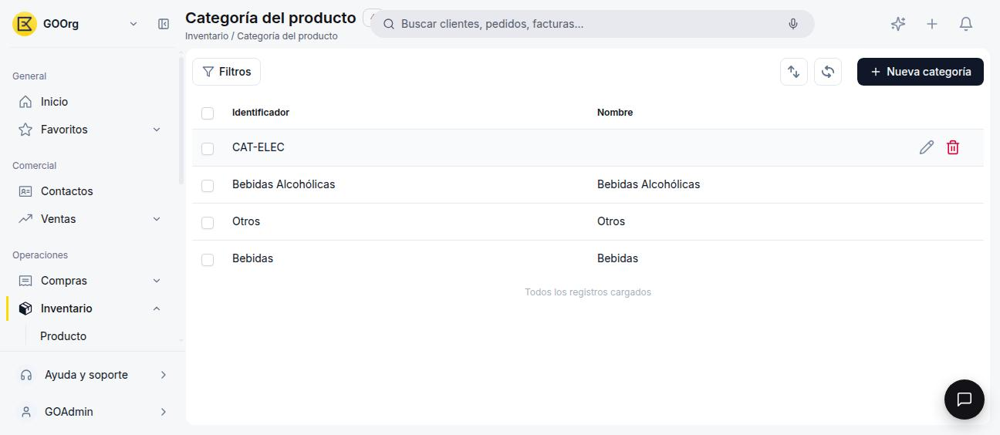
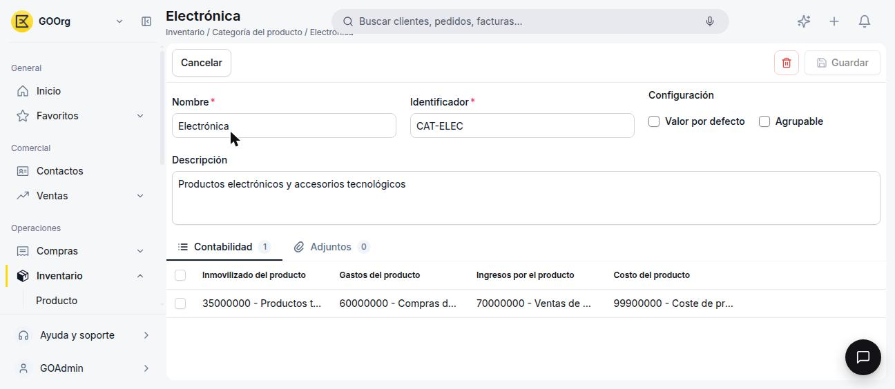

---
tags:
    - Categoría de producto
    - Producto
    - Inventario
    - Etendo Go
---

# Cómo crear y configurar una categoría de producto

Este artículo cubre cómo crear una categoría de producto y configurar la información contable que hereda cada producto asignado a ella.

## Ve a la ventana Categoría del producto

Ve a **[Inventario > Categoría del producto](https://go.etendo.cloud/product-category){target="_blank"}** y haz clic en **+ Nueva categoría**.

<figure markdown="span">
  
  <figcaption>Vista lista de Categoría del producto, con los íconos de editar y eliminar al pasar el cursor.</figcaption>
</figure>

## Completa el formulario

<figure markdown="span">
  
  <figcaption>Formulario de la categoría, con la pestaña Contabilidad y sus cuatro cuentas.</figcaption>
</figure>

- **Nombre** *(obligatorio)* — Nombre descriptivo. Ej. "Materiales".
- **Identificador** *(obligatorio)* — Código único de la categoría. Ej. `CAT-MAT`.
- **Descripción** *(opcional)*.
- **Valor por defecto** *(opcional)* — Si lo activas, esta categoría se preselecciona al crear un producto nuevo.
- **Agrupable** *(opcional)* — Actívalo si esta categoría es solo una carpeta para organizar otras categorías (por ejemplo, una categoría "Bebidas" que agrupa a "Bebidas con alcohol" y "Bebidas sin alcohol"). Una categoría agrupable no se puede asignar directamente a un producto.

## Configura la contabilidad de la categoría

!!! info "Visible solo para ciertos roles"
    La pestaña **Contabilidad** es visible únicamente para los roles **Administrator** y **Finance**.

En la pestaña **Contabilidad** defines las cuentas que van a heredar todos los productos asignados a esta categoría:

- **Inmovilizado del producto** — cuenta donde se valoriza el stock de estos productos mientras están en el almacén.
- **Gastos del producto** — cuenta que se usa al comprarlos.
- **Ingresos por el producto** — cuenta que se usa al venderlos.
- **Costo del producto** — cuenta donde se registra su costo de venta.

Una vez guardada la categoría, cualquier producto que la use toma esta configuración contable automáticamente, sin necesidad de definirla producto por producto.

También puedes usar la pestaña **Adjuntos** para asociar archivos a la categoría.

---

## Artículos Relacionados

- [Cómo crear un producto](../como-crear-un-producto/como-crear-un-producto.md)
- [¿Qué es la sección de Productos?](../index.md)

---
Esta obra está bajo la licencia :material-creative-commons: :fontawesome-brands-creative-commons-by: :fontawesome-brands-creative-commons-sa: [CC BY-SA 2.5 ES](https://creativecommons.org/licenses/by-sa/2.5/es/){target="_blank"} de [Futit Services S.L](https://etendo.software){target="_blank"}.
