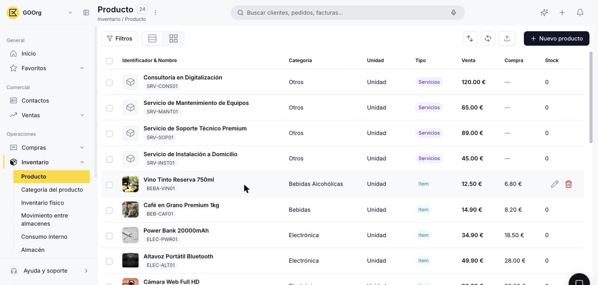
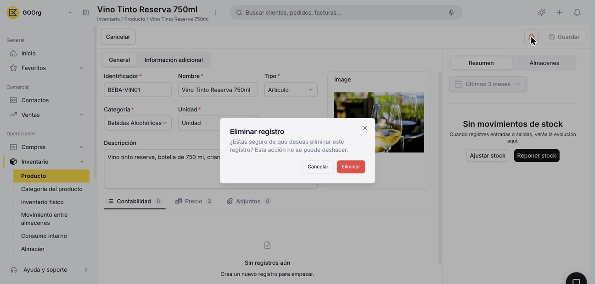

---
tags:
    - Producto
    - Inventario
    - Productos
    - Etendo Go
---

# Cómo editar o eliminar un producto

Este artículo cubre cómo modificar los datos de un producto existente y cómo eliminarlo cuando ya no lo necesites.

## Edita un producto

Ve a **[Inventario > Producto](https://go.etendo.cloud/product){target="_blank"}** y abre el producto desde la lista. El formulario se abre directamente en modo edición: modifica el campo que necesites y haz clic en **Guardar**.

## Elimina un producto

Pasa el cursor sobre la fila del producto en la lista y haz clic en el ícono de papelera, o abre el producto y usa el ícono de papelera de la barra superior.

<figure markdown="span">
  
  <figcaption>Al pasar el cursor sobre una fila de la lista aparecen los íconos de editar y eliminar.</figcaption>
</figure>

En ambos casos aparece el modal **Eliminar registro**, con la advertencia de que la acción no se puede deshacer.

<figure markdown="span">
  
  <figcaption>Modal de confirmación "Eliminar registro".</figcaption>
</figure>

!!! warning "No puedes eliminar un producto con movimientos"
    Si el producto tiene transacciones de stock o documentos asociados (pedidos, facturas, albaranes), Etendo Go bloquea la eliminación con un error: borrarlo rompería esos registros ya generados. En ese caso, el producto no se puede eliminar; solo puedes dejar de usarlo en documentos nuevos.

---

## Artículos Relacionados

- [Cómo crear un producto](../como-crear-un-producto/como-crear-un-producto.md)
- [¿Qué es la sección de Productos?](../index.md)
- [Cómo gestionar tarifas de producto](../como-gestionar-tarifas-de-producto/como-gestionar-tarifas-de-producto.md)

---
Esta obra está bajo la licencia :material-creative-commons: :fontawesome-brands-creative-commons-by: :fontawesome-brands-creative-commons-sa: [CC BY-SA 2.5 ES](https://creativecommons.org/licenses/by-sa/2.5/es/){target="_blank"} de [Futit Services S.L](https://etendo.software){target="_blank"}.
