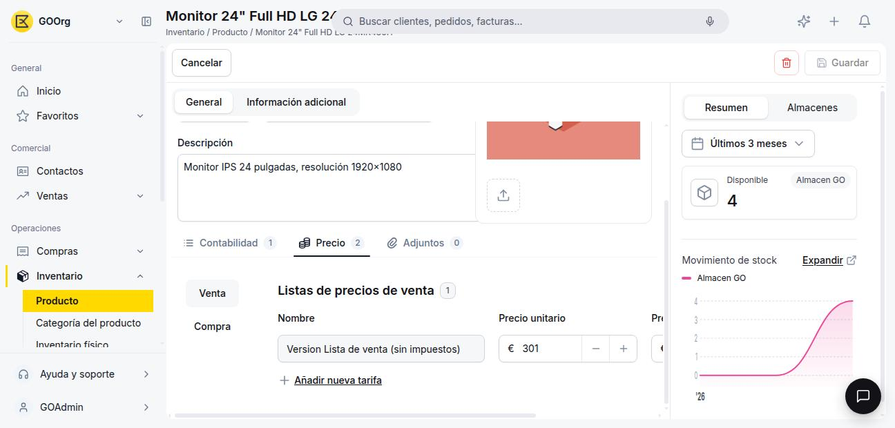
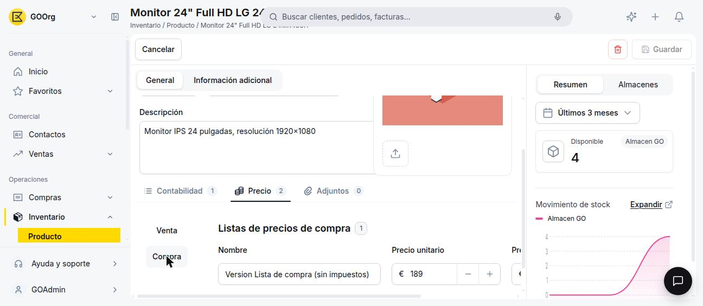

---
tags:
    - Producto
    - Tarifas
    - Inventario
    - Etendo Go
---

# Cómo gestionar tarifas de producto

Este artículo cubre cómo administrar los precios de un producto en las distintas tarifas de venta y compra, sin salir de su ficha.

## Ve a la pestaña Precio

Abre el producto desde **Inventario > Producto** y ve a la pestaña **Precio**. Un selector a la izquierda te permite alternar entre **Venta** y **Compra** para ver las tarifas de cada tipo por separado.

<figure markdown="span">
  
  <figcaption>Pestaña Precio con las listas de precios de venta del producto.</figcaption>
</figure>

<figure markdown="span">
  
  <figcaption>La misma pestaña, con el selector cambiado a Compra.</figcaption>
</figure>

## Agrega una tarifa

Haz clic en **+ Añadir nueva tarifa**, elige la tarifa en el desplegable y completa:

- **Precio unitario** — el precio que efectivamente se aplica en los documentos (presupuestos, pedidos, facturas). Se completa con los controles **−** / **+** o escribiendo el valor directamente.
- **Precio de lista** — un precio de referencia para esa tarifa (por ejemplo, antes de descuentos). Por sí solo no se usa en los documentos.

Cada cambio se guarda automáticamente al perder el foco del campo — no hay un botón "Guardar cambios" aparte.

## Edita o elimina una tarifa existente

Para editar, modifica el **Precio unitario** o el **Precio de lista** de una fila ya cargada. Para eliminar una tarifa, pasa el cursor sobre la fila y haz clic en el ícono de papelera que aparece.

---

## Artículos Relacionados

- [Cómo crear un producto](../como-crear-un-producto/como-crear-un-producto.md)
- [Cómo editar o eliminar un producto](../como-editar-o-eliminar-un-producto/como-editar-o-eliminar-un-producto.md)
- [¿Qué es la sección de Productos?](../index.md)

---
Esta obra está bajo la licencia :material-creative-commons: :fontawesome-brands-creative-commons-by: :fontawesome-brands-creative-commons-sa: [CC BY-SA 2.5 ES](https://creativecommons.org/licenses/by-sa/2.5/es/){target="_blank"} de [Futit Services S.L](https://etendo.software){target="_blank"}.
