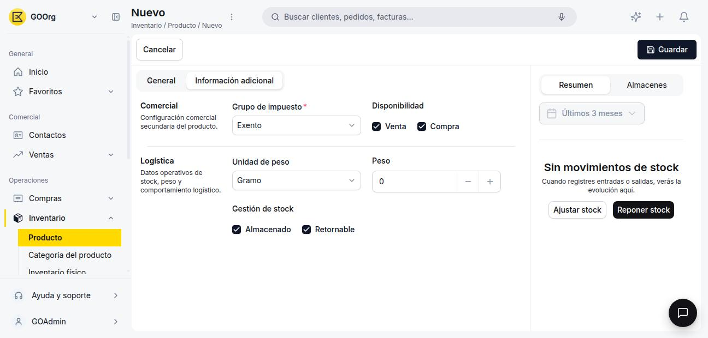

---
tags:
    - Producto
    - Inventario
    - Productos
    - Etendo Go
---

# Crear un producto

Este artículo cubre cómo dar de alta un producto nuevo en Etendo Go, ya sea un artículo con stock o un servicio.

## Ve a la ventana Producto

Ve a **[Inventario > Producto](https://go.etendo.cloud/product/new){target="_blank"}** y haz clic en **+ Nuevo producto**.

## Completa los datos generales

<figure markdown="span">
  
  <figcaption>Pestaña General del formulario de un producto nuevo.</figcaption>
</figure>

En la pestaña **General** completa:

- **Nombre** *(obligatorio)* — Nombre comercial del producto.
- **Identificador** *(obligatorio)* — Código interno (SKU) que lo identifica.
- **Categoría** *(obligatorio)* — Determina de forma automática las cuentas contables del producto (existencias, gastos, ingresos y costo). Por defecto viene la categoría **Otros**; para definir nuevas categorías, ve a la ventana [Categoría del producto](../crear-una-categoria-de-producto/crear-una-categoria-de-producto.md).
- **Unidad de medida** *(obligatorio)* — Ej. Unidad, Kg, Litro.
- **Tipo de producto** *(obligatorio)* — Cuatro opciones: **Artículo** (gestiona stock), **Servicio** (no genera movimientos de inventario), **Recurso** y **Gasto**.
- **Descripción** *(opcional)*.
- **Imagen** *(opcional)* — Se muestra en la vista catálogo.

!!! warning "Artículo vs. Servicio"
    Elige **Artículo** si necesitas controlar cuánto tienes disponible de este producto en tus almacenes. Elige **Servicio** si es algo que facturas pero que no se almacena físicamente. Ver [¿Qué es la sección de Productos?](../index.md).

## Completa la información adicional

<figure markdown="span">
  
  <figcaption>Pestaña Información adicional, con Grupo de impuesto, Disponibilidad y datos de Logística.</figcaption>
</figure>

En la pestaña **Información adicional** completa:

- **Grupo de impuesto** *(obligatorio)* — Se usa para la facturación.
- **Disponibilidad** (Venta / Compra) *(opcional)* — Marca si el producto puede usarse en documentos de venta, de compra, o ambos.
- **Unidad de peso** y **Peso** *(opcional)* — Datos logísticos del producto.
- **Gestión de stock** (Almacenado / Retornable) *(opcional)* — Indica si el producto se almacena y si es retornable.

!!! info "El precio se define después"
    El producto no tiene un precio único: los precios se configuran por tarifa, desde la pestaña **Precio**. Consulta [Gestionar tarifas de producto](../gestionar-tarifas-de-producto/gestionar-tarifas-de-producto.md).

Al guardar, el producto queda disponible para usarse en presupuestos, pedidos, albaranes y facturas.

---

## Artículos Relacionados

- [¿Qué es la sección de Productos?](../index.md)
- [Crear y configurar una categoría de producto](../crear-una-categoria-de-producto/crear-una-categoria-de-producto.md)
- [Gestionar tarifas de producto](../gestionar-tarifas-de-producto/gestionar-tarifas-de-producto.md)

---
Esta obra está bajo la licencia :material-creative-commons: :fontawesome-brands-creative-commons-by: :fontawesome-brands-creative-commons-sa: [CC BY-SA 2.5 ES](https://creativecommons.org/licenses/by-sa/2.5/es/){target="_blank"} de [Futit Services S.L](https://etendo.software){target="_blank"}.
