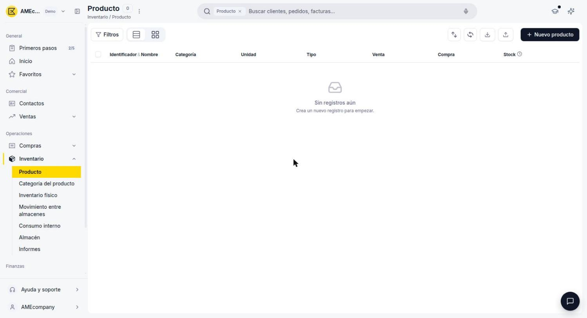
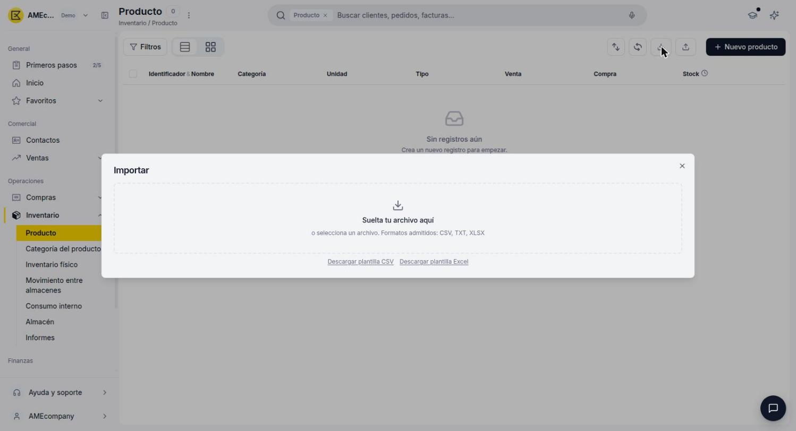
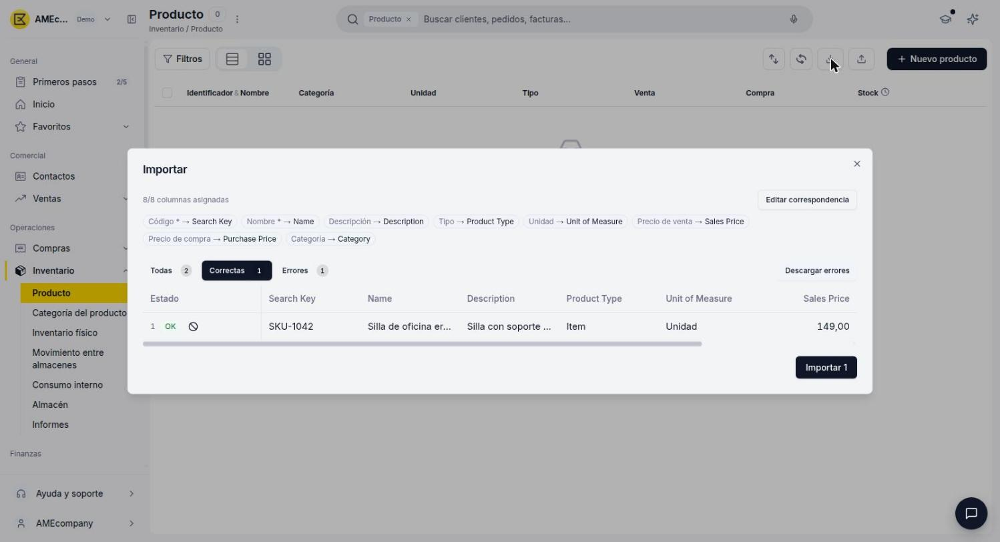
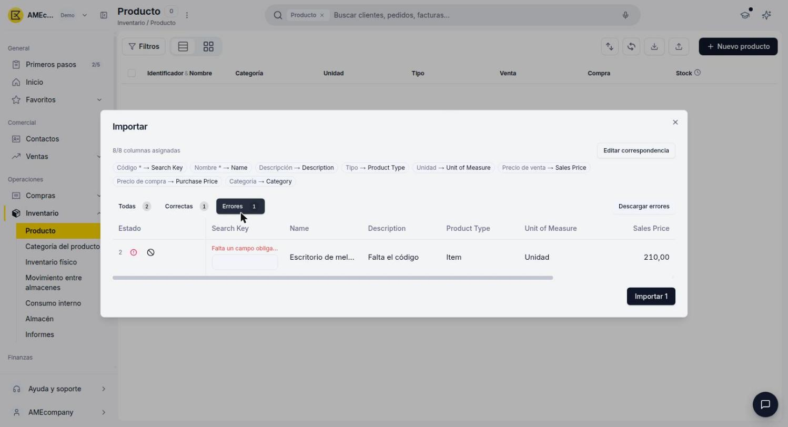
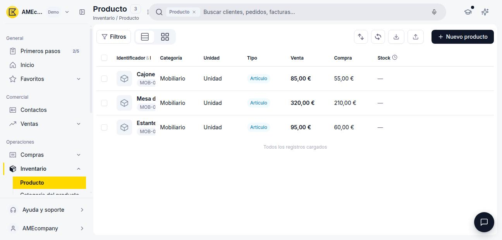

# Importar productos

Si necesitas dar de alta varios productos a la vez, en vez de crearlos uno por uno desde el formulario, puedes importarlos masivamente desde un archivo CSV, TXT o Excel.

## Abre la ventana de importación

1. Ve a **[Inventario > Producto](https://app.etendo.software/product){target="_blank"}**.
2. En la vista lista, haz clic en el ícono **Importar** de la barra de herramientas superior.

    <figure markdown="span">
      
      <figcaption>Ícono Importar en la barra de herramientas de la ventana Producto.</figcaption>
    </figure>

## Descarga la plantilla

En la ventana **Importar**, descarga la plantilla en el formato que prefieras (**CSV** o **Excel**) antes de preparar tu archivo.

<figure markdown="span">
  
  <figcaption>Ventana Importar: zona de carga de archivo y enlaces de descarga de plantilla.</figcaption>
</figure>

La plantilla trae las siguientes columnas:

- **Código** *(obligatorio)* — Identificador interno (SKU) del producto. Equivale al campo **Identificador** del formulario de alta manual.
- **Nombre** *(obligatorio)* — Nombre comercial del producto.
- **Descripción** *(opcional)*.
- **Tipo** *(opcional)* — Determina si el producto gestiona stock o no.
- **Unidad** *(opcional)* — Unidad de medida (ej. Unidad, Kg, Litro).
- **Precio de venta** y **Precio de compra** *(opcionales)*.
- **Categoría** *(opcional)* — Categoría de producto.

!!! warning "El campo Tipo usa el identificador interno, no el texto del formulario"
    La columna **Tipo** se completa con el identificador interno del tipo (por ejemplo, **Item** para Artículo, o **Servicio**), no con el texto que ves en el formulario de alta manual.

!!! info "Las categorías nuevas se crean automáticamente"
    Si la categoría que indicás en la columna **Categoría** no existe todavía, Etendo la crea automáticamente al importar. Si preferís configurarla vos mismo antes (por ejemplo, para definir sus cuentas contables), creála primero desde [Crear y configurar una categoría de producto](../crear-una-categoria-de-producto/crear-una-categoria-de-producto.md).

## Completa y carga tu archivo

1. Completa la plantilla con tus productos, respetando al menos las columnas obligatorias (**Código** y **Nombre**).
2. Vuelve a la ventana **Importar** y arrastra tu archivo a la zona indicada, o haz clic para seleccionarlo desde tu computadora.

## Revisa el mapeo de columnas

Al cargar el archivo, Etendo intenta emparejar automáticamente cada columna de tu archivo con el campo correspondiente del producto (por ejemplo, **Código** → **Search Key**, **Nombre** → **Name**). Si alguna columna no se asignó correctamente, haz clic en **Editar correspondencia** para corregirla manualmente antes de continuar.

## Revisa las filas correctas y con errores

Debajo del mapeo, Etendo separa las filas de tu archivo en dos pestañas:

- **Correctas** — filas listas para importarse.
- **Errores** — filas con datos faltantes o inválidos, con el motivo indicado en rojo (por ejemplo, "Falta un campo obligatorio").

<figure markdown="span">
  
  <figcaption>Pestaña Correctas: fila validada, lista para importar.</figcaption>
</figure>

<figure markdown="span">
  
  <figcaption>Pestaña Errores: fila con un campo obligatorio faltante, editable en la misma tabla.</figcaption>
</figure>

Puedes corregir un error directamente en la celda resaltada de la tabla, o hacer clic en **Descargar errores** para exportar solo las filas con problemas, corregirlas en tu archivo original y volver a importarlas después.

!!! info "Importar solo lo que está correcto"
    No hace falta que corrijas los errores para avanzar: el botón **Importar** solo carga las filas de la pestaña **Correctas**. Las filas con errores quedan afuera hasta que las corrijas y las vuelvas a importar.

## Importa los productos

Haz clic en **Importar [cantidad]**, y confirma en el diálogo que se abre a continuación. Los productos importados quedan disponibles en la vista lista de Producto, igual que si los hubieras creado manualmente.

<figure markdown="span">
  
  <figcaption>Vista lista de Producto después de una importación exitosa.</figcaption>
</figure>

!!! tip "Espera a que termine antes de revisar el resultado"
    Etendo procesa cada producto de forma individual, así que para lotes de varias filas la importación puede tardar unos segundos en completarse. Espera a que termine antes de salir de la ventana o revisar la vista lista de Producto.

---

## Artículos Relacionados

- [¿Qué es la sección de Productos?](../index.md)
- [Crear un producto](../crear-un-producto/crear-un-producto.md)
- [Crear y configurar una categoría de producto](../crear-una-categoria-de-producto/crear-una-categoria-de-producto.md)
- [Gestionar tarifas de producto](../gestionar-tarifas-de-producto/gestionar-tarifas-de-producto.md)

---
Esta obra está bajo la licencia :material-creative-commons: :fontawesome-brands-creative-commons-by: :fontawesome-brands-creative-commons-sa: [CC BY-SA 2.5 ES](https://creativecommons.org/licenses/by-sa/2.5/es/){target="_blank"} de [Futit Services S.L](https://etendo.software){target="_blank"}.
