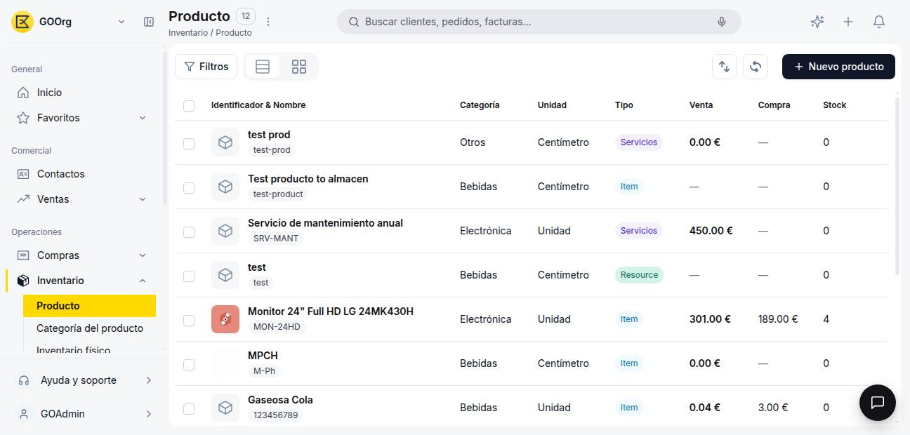

---
tags:
    - Productos
    - Inventario
    - Categoría de producto
    - Etendo Go
---

# ¿Qué es la sección de Productos?

La sección **Productos** concentra toda la información comercial, logística y de stock de lo que vendes o compras en Etendo Go. Es el maestro central del módulo Inventario: cada línea de un presupuesto, pedido, albarán o factura hace referencia a un producto definido acá.

<figure markdown="span">
  
  <figcaption>Vista lista de Producto, con columnas de Categoría, Unidad, Tipo, Venta, Compra y Stock.</figcaption>
</figure>

La columna **Stock** de esta lista no es la de un almacén en particular: suma la existencia del producto en todos tus almacenes. Para ver el detalle por almacén, entra al [almacén](../almacenes/index.md) que te interese.

## Tipos de producto

Al crear un producto elegís su tipo entre cuatro opciones: **Artículo**, **Servicio**, **Recurso** y **Gasto**. Esta es la primera decisión que tomas al dar de alta un producto, y no se puede cambiar después sin crear un producto nuevo.

Las dos más habituales son:

- **Artículo** — gestiona stock. Sus movimientos de entrada y salida se registran en los almacenes, y puedes consultar en todo momento cuánto tienes disponible.
- **Servicio** — no genera movimientos de inventario, aunque sí puede facturarse como cualquier otro producto.

## Categoría y configuración contable

Todo producto pertenece a una **categoría de producto**. La categoría agrupa productos bajo una configuración contable común: define las cuentas contables (de existencias, de gastos, de ingresos y de costo) que se usan cuando ese producto se compra, se vende o se ajusta su stock. Al asignarle una categoría a un producto, el sistema hereda automáticamente esas cuentas, sin que tengas que definirlas de nuevo para cada producto.

## Precios y tarifas

Una **tarifa** es una lista de precios independiente (por ejemplo, "Lista mayorista" o "Lista minorista"). Cada producto puede tener uno o más precios asignados, tanto de venta como de compra, organizados por tarifa. Esto te permite, por ejemplo, tener un precio distinto para un cliente mayorista que para uno minorista, sin duplicar el producto.

## Disponibilidad de venta y compra

Cada producto indica si está disponible para documentos de **venta**, de **compra**, o ambos. Esto te permite, por ejemplo, dar de alta un producto que solo compras a un proveedor sin que aparezca como opción al armar un presupuesto de venta.

## Recursos y próximos pasos

Antes de crear tu primer producto, conviene tener definida al menos una [categoría de producto](como-crear-una-categoria-de-producto/como-crear-una-categoria-de-producto.md).

---

## Artículos Relacionados

- [Cómo crear un producto](como-crear-un-producto/como-crear-un-producto.md)
- [Cómo crear y configurar una categoría de producto](como-crear-una-categoria-de-producto/como-crear-una-categoria-de-producto.md)
- [¿Qué es la sección Almacén?](../almacenes/index.md)

---
Esta obra está bajo la licencia :material-creative-commons: :fontawesome-brands-creative-commons-by: :fontawesome-brands-creative-commons-sa: [CC BY-SA 2.5 ES](https://creativecommons.org/licenses/by-sa/2.5/es/){target="_blank"} de [Futit Services S.L](https://etendo.software){target="_blank"}.
