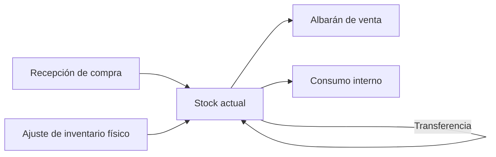
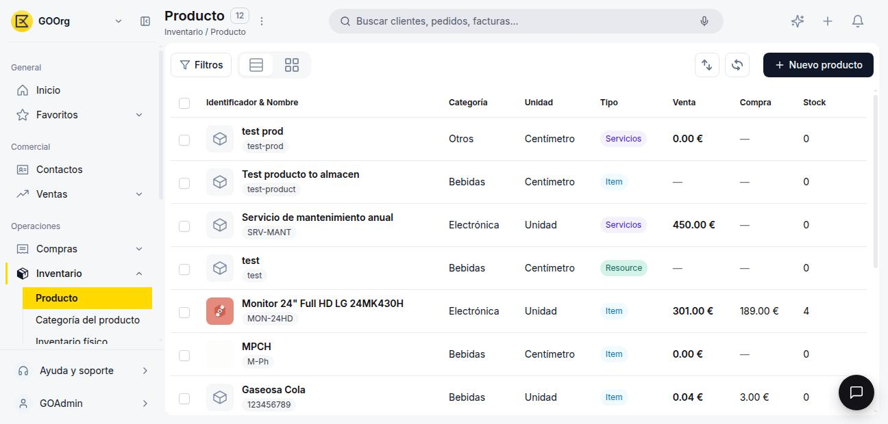

---
tags:
    - Inventario
    - Operaciones
    - Almacenes
    - Productos
    - Etendo Go
---

# ¿Qué es la sección Inventario?

La sección **Inventario** es donde Etendo Go gestiona tu stock, tus almacenes y los productos que vendes o compras. Desde acá controlas qué tienes, dónde lo tienes y bajo qué condiciones contables se registra cada producto.

Inventario cubre el ciclo completo de entradas y salidas de mercancía:

El stock entra al sistema principalmente cuando recibes una compra o cuando ajustas un conteo físico. Desde ahí, cada unidad queda asignada a un almacén concreto y disponible para salir por una venta o por un consumo interno. En el medio, puedes mover mercancía de un almacén a otro sin que eso se registre como una venta ni como una compra.

El stock se gestiona **por almacén**: cada almacén mantiene su propio stock de forma independiente, y puedes transferir mercancía entre ellos. Esto te permite saber en todo momento cuánto tienes disponible y en qué ubicación física se encuentra.

## Qué incluye esta sección

<figure markdown="span">
  
  <figcaption>Menú de Inventario expandido en la barra lateral, con acceso a Producto y Categoría del producto.</figcaption>
</figure>

- **Categoría del producto** — agrupa tus productos bajo una configuración contable común, para que no tengas que definirla producto por producto.
- **Producto** — el maestro central de todo lo que vendes o compras: su tipo (con o sin stock), su categoría, su unidad de medida y sus tarifas de precio.
- **Almacén** — tus ubicaciones físicas de stock, cada una con su propia valoración y su historial de movimientos.

## Acceso y roles

Todas las ventanas de Inventario están disponibles para cualquier rol, sin restricciones. La única excepción es la pestaña **Contabilidad** de Categoría del producto, visible solo para los roles **Administrator** y **Finance**, ya que ahí se definen las cuentas contables que hereda cada producto.

## Recursos y próximos pasos

Para empezar a operar, define primero tus [categorías de producto](../productos/como-crear-una-categoria-de-producto/como-crear-una-categoria-de-producto.md), después da de alta tus [productos](../productos/como-crear-un-producto/como-crear-un-producto.md) y por último tus [almacenes](../almacenes/como-crear-un-almacen/como-crear-un-almacen.md). Con esos tres elementos configurados, ya puedes empezar a registrar stock desde [Compras](../../compras/index.md) o desde un ajuste de inventario.

---

## Artículos Relacionados

- [¿Qué es la sección de Productos?](../productos/index.md)
- [¿Qué es la sección Almacén?](../almacenes/index.md)

---
Esta obra está bajo la licencia :material-creative-commons: :fontawesome-brands-creative-commons-by: :fontawesome-brands-creative-commons-sa: [CC BY-SA 2.5 ES](https://creativecommons.org/licenses/by-sa/2.5/es/){target="_blank"} de [Futit Services S.L](https://etendo.software){target="_blank"}.
