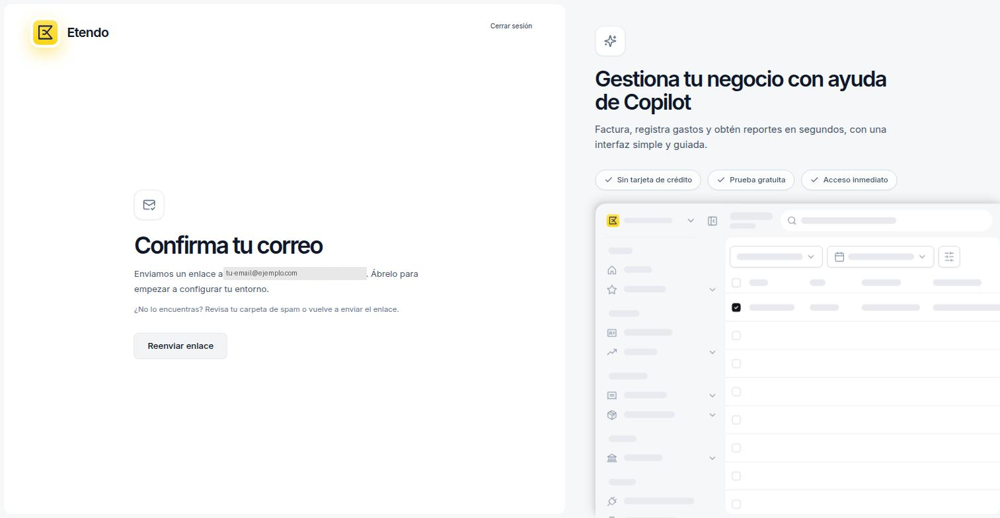
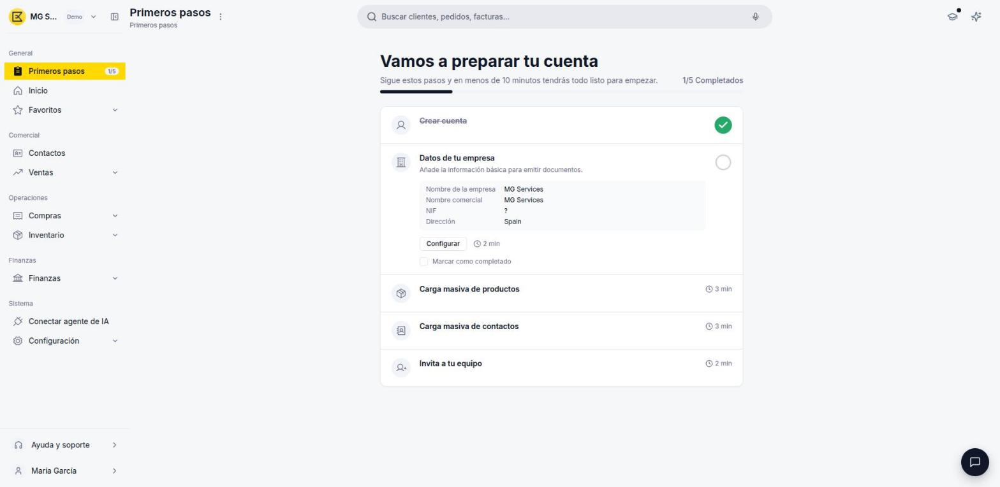
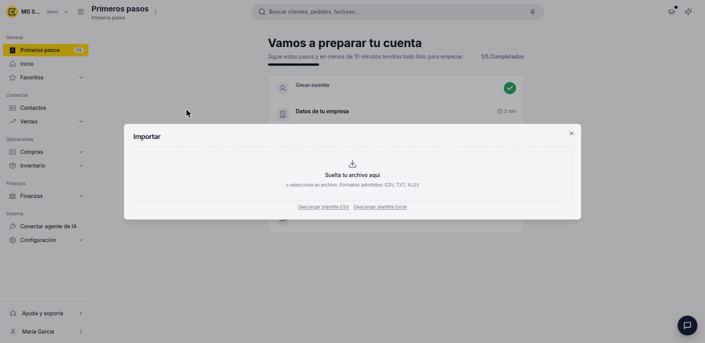
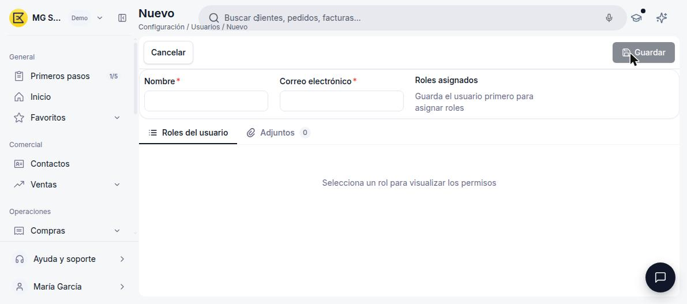

# Cómo crear tu cuenta

Etendo permite crear una cuenta gratuita en menos de un minuto, sin necesidad de tarjeta de crédito. Vas a completar cuatro pasos: registro de usuario, confirmación de correo, perfil y datos de empresa. Una vez finalizados, Etendo prepara tu espacio de trabajo automáticamente y te lleva a **Primeros pasos**, una lista de tareas recomendadas para terminar de configurar tu cuenta.

## Registro de usuario

1. Accede a la página de registro de Etendo. Verás el formulario **Crea tu cuenta gratis**.

    

    !!! tip "Registrarte con Google"
        También puedes crear la cuenta con un clic usando la opción **Sign in as...** con tu cuenta de Google, en lugar de completar el formulario manualmente.

2. Completa los siguientes campos obligatorios:
    - **Nombre** — tu nombre completo como administrador de la cuenta.
    - **Correo electrónico** — dirección de email que usarás para iniciar sesión.
    - **Contraseña** — debe cumplir todos los requisitos mostrados en pantalla.

    !!! info "Requisitos de la contraseña"
        Debe tener al menos 8 caracteres, e incluir una letra mayúscula, una letra minúscula, un número y un carácter especial (`!@#$%...`).

    !!! tip "Idioma"
        Puedes cambiar el idioma de la interfaz desde el selector **IDIOMA** en la parte superior del formulario antes de continuar.

3. Haz clic en **Crear cuenta**.

## Confirma tu correo

Antes de continuar, Etendo te pide que confirmes tu dirección de email.

1. Abre la casilla de entrada del correo con el que te registraste.

    

2. Haz clic en el enlace que te enviamos para confirmar tu cuenta.

!!! tip "¿No llegó el correo?"
    Revisa tu carpeta de spam o haz clic en **Reenviar enlace** desde esta misma pantalla.

Al confirmar tu correo, Etendo te lleva automáticamente al paso de perfil.

## Perfil y tipo de negocio

Tras crear la cuenta, Etendo te redirige al paso de perfil.

1. Revisa o edita el **Nombre completo** (se pre-rellena con el nombre del paso anterior).

    

2. Selecciona tu **País**. Para empresas españolas, el selector aparece por defecto en *España*.
3. Elige el **Tipo de negocio** que corresponda:
    - **Empresa** — sociedades como S.L. o S.A., o cooperativas.
    - **Autónomo** — trabajador por cuenta propia.
4. Haz clic en **Continuar** para avanzar al siguiente paso.

## Datos de la empresa

Este paso recoge los datos fiscales que Etendo usará en tus facturas y documentos comerciales.

1. Completa los siguientes campos:

    

    - **Nombre de la empresa** — razón social completa (ej: *MG Services*). Campo obligatorio.
    - **Identificación fiscal (NIF)** — El NIF de una empresa empieza por letra (ej: *B12345678*). Para autónomos, introduce el DNI o NIE. Campo opcional.
    - **Dirección** — dirección fiscal. Campo opcional.
    - **Sector** — actividad principal de la empresa. Por defecto: *Tecnología*. Campo opcional.

    !!! info "Edición posterior"
        Todos estos datos se pueden modificar después desde [**Configuración**](https://app.etendo.ai/organization){target="_blank"}.

2. Haz clic en **Empezar**.

## Preparando tu espacio

Etendo crea el espacio de trabajo de tu empresa. Este proceso tarda unos segundos.

## Primeros pasos

Al finalizar, Etendo te lleva directo a la sección **Primeros pasos**, con un mensaje como *"Vamos a preparar tu cuenta. Sigue estos pasos y en menos de 10 minutos tendrás todo listo para empezar"* y tu progreso (por ejemplo, *1/5 Completados*).

Cada tarea muestra una breve descripción y el tiempo estimado para completarla. Todas tienen un botón propio (**Importar** o **Configurar**) que te lleva directo a la pantalla correspondiente, y una casilla **Marcar como completado** para confirmarla manualmente:

- **Crear cuenta** — se marca como completada automáticamente apenas terminas el registro.
- **Datos de tu empresa** — esta tarea requiere que confirmes manualmente la casilla **Marcar como completado**, por eso sigue apareciendo como pendiente aunque ya hayas cargado esos datos en el paso anterior. Se muestra un resumen de lo que cargaste (nombre de la empresa, nombre comercial, NIF y dirección). El botón **Configurar** (2 min) te lleva a [**Configuración > Organización**](https://app.etendo.ai/organization){target="_blank"}, donde puedes revisar esos datos y subir el logo de tu empresa.
- **Carga masiva de productos** — el botón **Importar** (3 min) abre una ventana para arrastrar un archivo CSV, TXT o XLSX, con plantillas descargables listas para completar.

    

- **Carga masiva de contactos** — el botón **Importar** (3 min) abre la misma ventana de importación, para cargar tus clientes y proveedores.
- **Invita a tu equipo** — el botón **Configurar** (2 min) te lleva a [**Configuración > Roles**](https://app.etendo.ai/roles){target="_blank"}, desde donde puedes invitar usuarios:
    1. Elige uno de los roles disponibles (Administrador, Ventas, Compras, Finanzas o Inventario) para ver sus permisos y la lista de usuarios de ese rol.
    2. Haz clic en [**Nuevo usuario**](https://app.etendo.ai/user/new){target="_blank"} para abrir el formulario de invitación:

        

        - **Nombre** y **Correo electrónico** — campos obligatorios para enviar la invitación.
        - **Roles asignados** — se configuran después de guardar el usuario.

El panel queda disponible en cualquier momento desde el menú [**General > Primeros pasos**](https://app.etendo.ai/first-steps){target="_blank"}. Cuando completas las cinco tareas, el mensaje cambia a *"Ya lo tienes todo listo"* y Etendo te invita a crear tu primera factura.

## Inicio

Desde el menú **General**, también accedes a [**Inicio**](https://app.etendo.ai/dashboard){target="_blank"}, el panel principal de tu empresa. La primera vez aparece vacío, listo para registrar tu actividad.

Desde aquí puedes consultar, entre otros, los siguientes paneles de información:

- **Tareas pendientes**
- **Accesos rápidos**
- **Clientes destacados**
- **Resumen financiero**
- **Ventas recientes**
- **Cobros y pagos**
- **Evolución financiera**
- **Productos más vendidos**

Tu cuenta ya está lista para usarse. A partir de ahora, cada operación que registres irá dando forma a tu Inicio.

## Artículos Relacionados

- [¿Qué es Etendo?](../que-es-etendo/que-es-etendo.md)
- [Cómo gestionar tu organización](../../sistema/configuracion/como-gestionar-tu-organizacion/como-gestionar-tu-organizacion.md) — revisa y ajusta estos mismos datos cuando quieras, desde Configuración.
- [Contactos](../../comercial/contactos/que-es-la-seccion-contactos/que-es-la-seccion-contactos.md)

---
Esta obra está bajo la licencia :material-creative-commons: :fontawesome-brands-creative-commons-by: :fontawesome-brands-creative-commons-sa: [CC BY-SA 2.5 ES](https://creativecommons.org/licenses/by-sa/2.5/es/){target="_blank"} de [Futit Services S.L](https://etendo.software){target="_blank"}.
