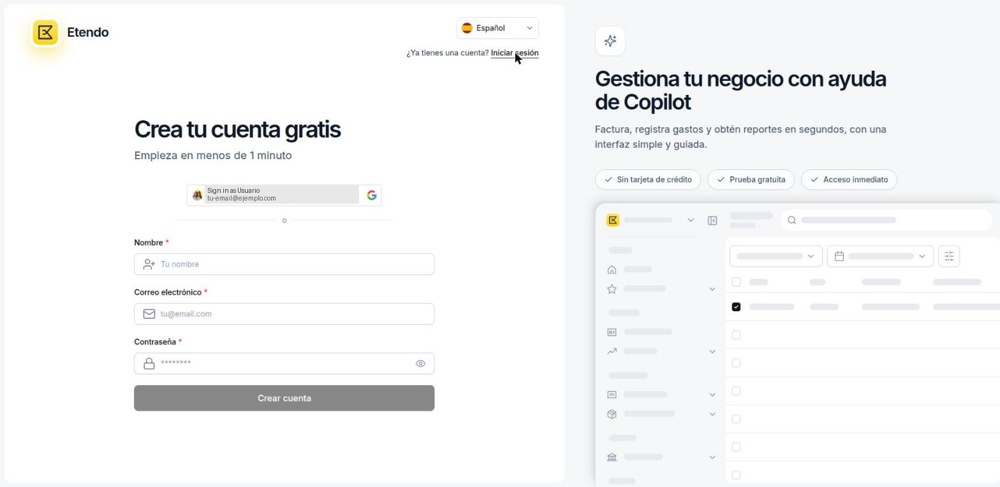
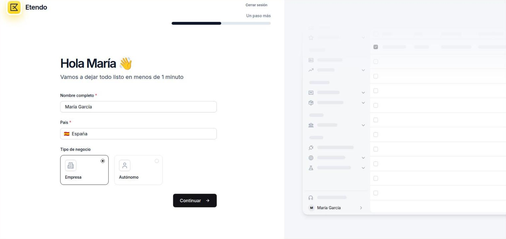
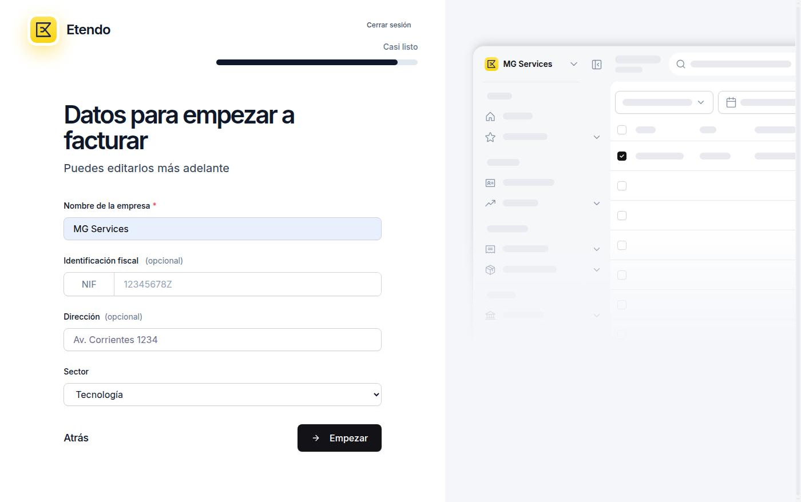
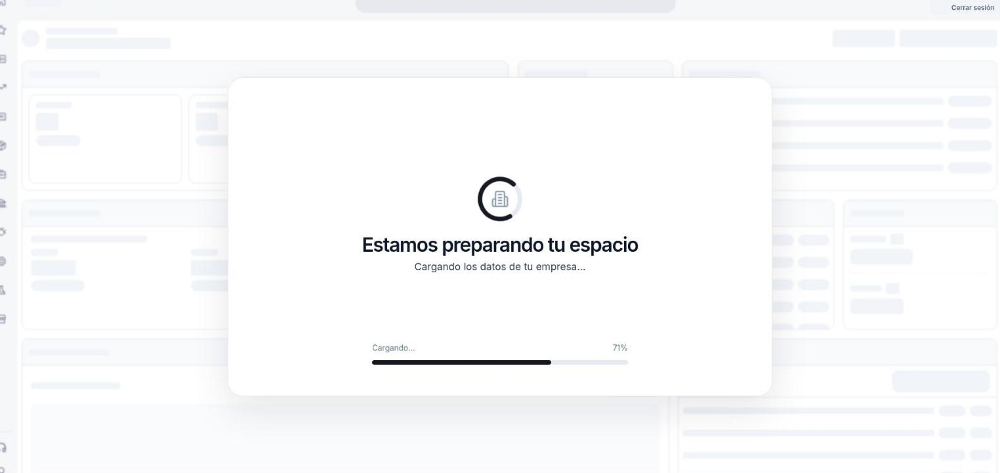

# Cómo crear tu cuenta

Etendo Go permite crear una cuenta gratuita en menos de un minuto, sin necesidad de tarjeta de crédito. Vas a completar tres pasos: registro de usuario, perfil y datos de empresa. Una vez finalizados, Etendo Go prepara tu espacio de trabajo automáticamente y te lleva directo al Inicio, sin que tengas que hacer nada más.

## Registro de usuario

1. Accede a la página de registro de Etendo Go. Verás el formulario **Crea tu cuenta gratis**.

    

2. Completa los siguientes campos obligatorios:
    - **Nombre** — tu nombre completo como administrador de la cuenta.
    - **Correo electrónico** — dirección de email que usarás para iniciar sesión.
    - **Contraseña** — debe cumplir todos los requisitos mostrados en pantalla.

    !!! info "Requisitos de la contraseña"
        Debe tener al menos 8 caracteres, e incluir una letra mayúscula, una letra minúscula, un número y un carácter especial (`!@#$%...`).

    !!! tip "Idioma"
        Puedes cambiar el idioma de la interfaz desde el selector **IDIOMA** en la parte superior del formulario antes de continuar.

3. Haz clic en **Crear cuenta**.

## Perfil y tipo de negocio

Tras crear la cuenta, Etendo Go te redirige al paso de perfil.

1. Revisa o edita el **Nombre completo** (se pre-rellena con el nombre del paso anterior).

    

2. Selecciona tu **País**. Para empresas españolas, el selector aparece por defecto en *España*.
3. Elige el **Tipo de negocio** que corresponda:
    - **Empresa** — sociedades (S.L., S.A., etc.) con NIF de empresa.
    - **Autónomo** — trabajador por cuenta propia con DNI/NIE.
    - **Asesoría** — despachos y firmas de asesoramiento.
4. Haz clic en **Continuar** para avanzar al siguiente paso.

## Datos de la empresa

Este paso recoge los datos fiscales que Etendo Go usará en tus facturas y documentos comerciales.

1. Completa los siguientes campos:

    

    - **Nombre de la empresa** — razón social completa (ej: *SMF Consulting S.L.*). Campo obligatorio.
    - **Identificación fiscal (NIF)** — NIF de empresa empieza por letra (ej: *B12345678*). Para autónomos, introduce el DNI o NIE. Campo obligatorio.
    - **Dirección** — dirección fiscal. Puedes añadirla más adelante desde **Configuración**. Campo opcional.
    - **Sector** — actividad principal de la empresa. Por defecto: *Tecnología*. Campo opcional.

    !!! info "Edición posterior"
        Todos estos datos se pueden modificar después desde **Configuración**.

2. Haz clic en **Empezar**.

## Preparando tu espacio

Etendo Go crea el espacio de trabajo de tu empresa. Este proceso tarda unos segundos.

## Inicio

Al finalizar, accedes al **Inicio** de tu empresa. La primera vez aparece vacío, listo para registrar tu actividad.

Desde aquí puedes consultar, entre otros, los siguientes widgets:

- **Tareas pendientes**
- **Accesos rápidos**
- **Clientes destacados**
- **Resumen financiero**
- **Ventas recientes**
- **Cobros y pagos**
- **Evolución financiera**
- **Productos más vendidos**

Tu cuenta ya está lista para usarse. A partir de ahora, cada operación que registres irá dando forma a tu Inicio.

## Artículos Relacionados

- [¿Qué es Etendo Go?](../que-es-etendo-go/que-es-etendo-go.md)
- [Contactos](../../comercial/contactos/contactos.md)
- [Configuración](../../configuracion/index.md)

---
Esta obra está bajo la licencia :material-creative-commons: :fontawesome-brands-creative-commons-by: :fontawesome-brands-creative-commons-sa: [CC BY-SA 2.5 ES](https://creativecommons.org/licenses/by-sa/2.5/es/){target="_blank"} de [Futit Services S.L](https://etendo.software){target="_blank"}.

