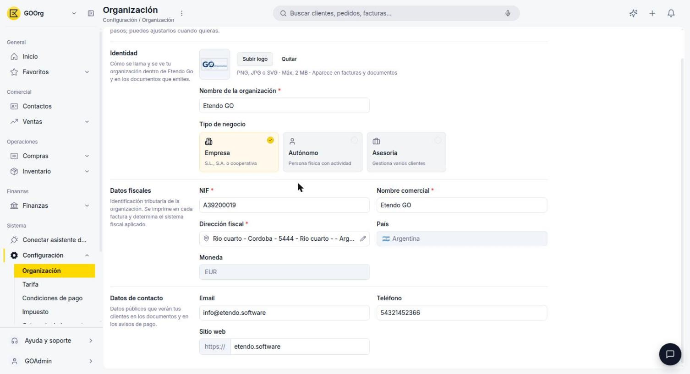
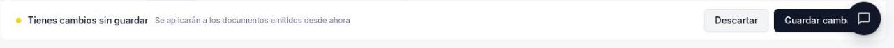
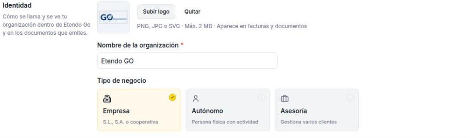
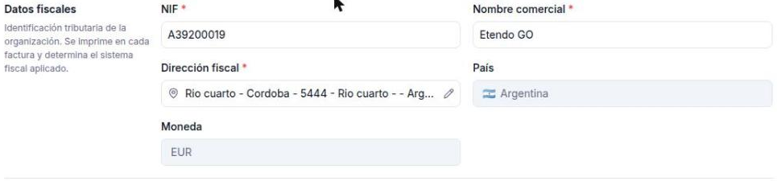
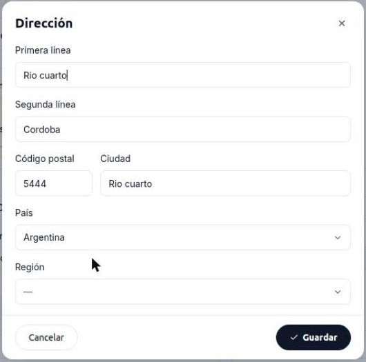
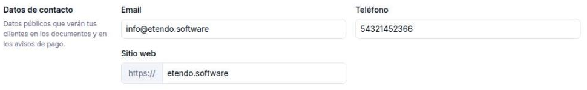

# Cómo gestionar tu cuenta

Los datos de tu cuenta que completaste al registrarte (identidad, datos fiscales y de contacto) no quedan fijos: puedes revisarlos y ajustarlos en cualquier momento desde la ventana **Organización**, dentro de **Configuración**. Estos datos son los que aparecen en tus facturas, presupuestos y demás documentos fiscales.

## Acceder a la ventana Organización

1. En el menú lateral, dentro de la sección **Sistema**, haz clic en **Configuración**.
2. Selecciona **Organización**, la primera opción del submenú.

## Guardar los cambios

Antes de revisar cada dato, conviene saber cómo se guardan los cambios: el mecanismo es el mismo sin importar qué campo modifiques.

Apenas modificas un campo, aparece al pie de la pantalla una barra con el aviso **Tienes cambios sin guardar** y dos botones:

- **Guardar cambios** — aplica los ajustes.
- **Descartar** — vuelve a los valores anteriores sin guardar nada.

!!! tip "Qué pasa con los documentos ya emitidos"
    Los cambios se aplican a los documentos que emitas desde ese momento en adelante. Las facturas y demás documentos que ya emitiste no se modifican.

Con esto en cuenta, estos son los tres bloques de datos que vas a encontrar en la ventana Organización:

## Identidad

Define cómo se llama y se ve tu organización dentro de Etendo Go y en los documentos que emites.

- **Logo** — imagen que representa a tu organización en facturas y demás documentos. Formatos admitidos: PNG, JPG o SVG (máx. 2 MB). Haz clic en **Subir logo** para cargarla, o en **Quitar** para eliminarla.
- **Nombre de la organización** — nombre con el que identificas tu cuenta dentro de Etendo Go. Campo obligatorio.
- **Tipo de negocio** — elige entre **Empresa** (S.L., S.A. o cooperativa), **Autónomo** (persona física con actividad) o **Asesoría** (gestiona varios clientes).

## Datos fiscales

Es la identificación tributaria de tu organización: se imprime en cada factura y determina el sistema fiscal aplicado.

!!! info "Mismos datos, otro nombre"
    **NIF** y **Nombre comercial** son los mismos datos que completaste al [crear tu cuenta](../como-crear-tu-cuenta/como-crear-tu-cuenta.md#datos-de-la-empresa), donde el formulario los llama **Identificación fiscal (NIF)** y **Nombre de la empresa**.

- **NIF** — identificación tributaria de tu organización. Campo obligatorio.
- **Nombre comercial** — nombre con el que aparece tu organización en facturas y demás documentos fiscales. Campo obligatorio.
- **Dirección fiscal** — campo obligatorio, se edita en una ventana aparte:
    1. Haz clic en el ícono de lápiz, junto a la dirección.
    2. Completa **Primera línea**, **Segunda línea**, **Código postal**, **Ciudad**, **País** y **Región**.
    3. Haz clic en **Guardar** para confirmar la dirección y cerrar la ventana.

    

    !!! tip "Dos botones \"Guardar\""
        El **Guardar** de este formulario solo confirma la dirección. El cambio queda pendiente hasta que además hagas clic en **Guardar cambios**, como se explicó en [Guardar los cambios](#guardar-los-cambios).

- **País** y **Moneda** — solo informativos: no se editan desde esta pantalla, quedan fijados según lo que elegiste al crear la cuenta.

!!! info "País y moneda fijos"
    Si necesitas cambiar el país o la moneda de tu organización, contacta con soporte de Etendo Go; no es un ajuste que puedas hacer tú mismo desde Configuración.

## Datos de contacto

Son los datos públicos que verán tus clientes en los documentos y en los avisos de pago.

- **Email** — dirección de correo de contacto de tu organización.
- **Teléfono** — número de contacto de tu organización.
- **Sitio web** — dirección de tu sitio, se completa después de `https://`.

## Artículos Relacionados

- [Cómo crear tu cuenta](../como-crear-tu-cuenta/como-crear-tu-cuenta.md) — el registro inicial en el que completas por primera vez estos mismos datos.
- [Navegar en Etendo Go](../navegar-en-etendo-go/navegar-en-etendo-go.md) — reconoce los menús y componentes que vas a usar para llegar a cualquier pantalla de Configuración.

---
Esta obra está bajo la licencia :material-creative-commons: :fontawesome-brands-creative-commons-by: :fontawesome-brands-creative-commons-sa: [CC BY-SA 2.5 ES](https://creativecommons.org/licenses/by-sa/2.5/es/){target="_blank"} de [Futit Services S.L](https://etendo.software){target="_blank"}.
