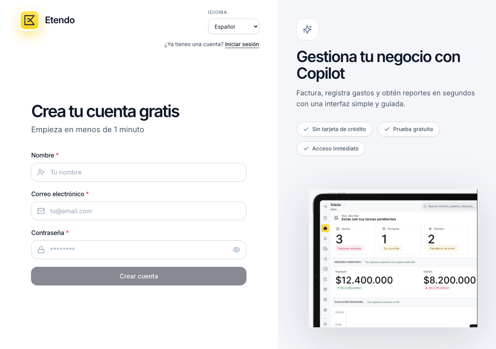
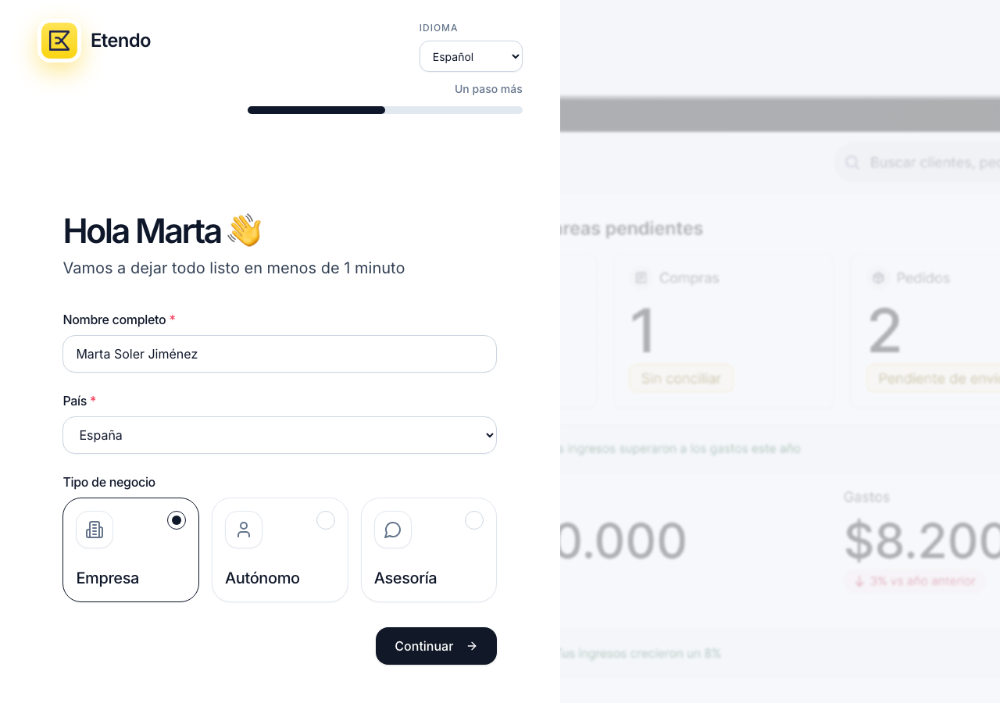
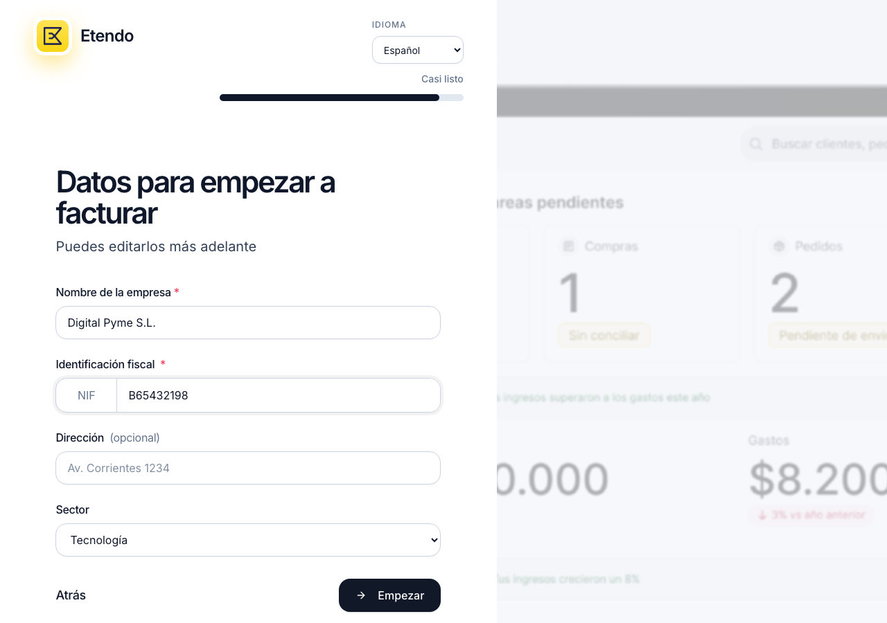
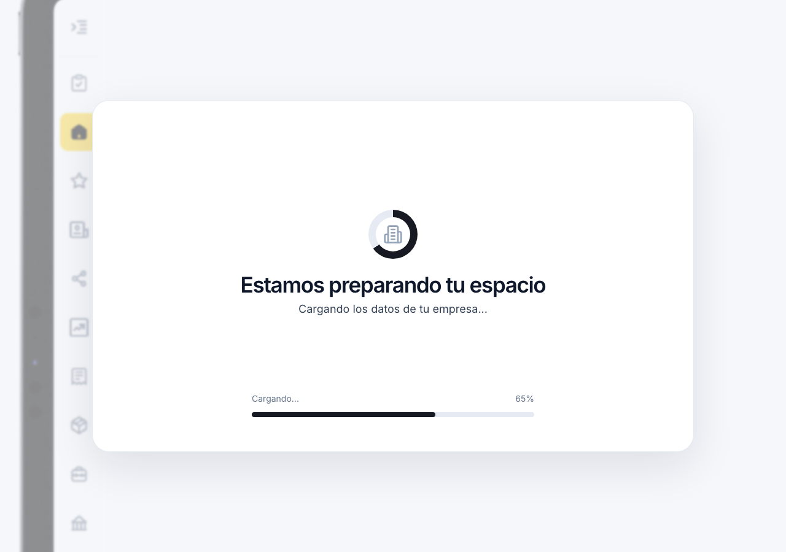
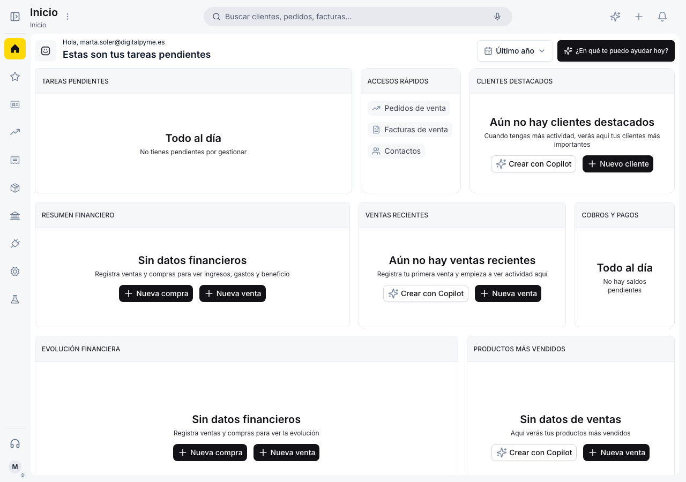

# Crear una cuenta

Etendo Go permite crear una cuenta gratuita en menos de un minuto, sin necesidad de tarjeta de crédito. El proceso se divide en tres pasos: registro de usuario, perfil y datos de empresa.

---

## Registro de usuario

Accede a la página de registro de Etendo Go. Verás el formulario **Crea tu cuenta gratis**.

Completa los siguientes campos obligatorios:

- **Nombre** — tu nombre completo como administrador de la cuenta.
- **Correo electrónico** — dirección de email que usarás para iniciar sesión.
- **Contraseña** — debe cumplir todos los requisitos mostrados en pantalla:
    - Al menos 8 caracteres
    - Una letra mayúscula
    - Una letra minúscula
    - Un número
    - Un carácter especial (`!@#$%...`)

!!! tip "Idioma"
    Puedes cambiar el idioma de la interfaz desde el selector **IDIOMA** en la parte superior del formulario antes de continuar.

Una vez completados los campos, haz clic en **Crear cuenta**.

---

## Perfil y tipo de negocio

Tras crear la cuenta, Etendo Go te redirige al paso de perfil.

Revisa o edita el **Nombre completo** (se pre-rellena con el nombre del paso anterior).

Selecciona tu **País**. Para empresas españolas, el selector aparece por defecto en *España*.

Elige el **Tipo de negocio** que corresponda:

- **Empresa** — sociedades (S.L., S.A., etc.) con NIF de empresa.
- **Autónomo** — trabajador por cuenta propia con DNI/NIE.
- **Asesoría** — despachos y firmas de asesoramiento.

Haz clic en **Continuar** para avanzar al siguiente paso.

---

## Datos de la empresa

Este paso recoge los datos fiscales que Etendo Go usará en tus facturas y documentos comerciales.

- **Nombre de la empresa** — razón social completa (ej: *SMF Consulting S.L.*). Campo obligatorio.
- **Identificación fiscal (NIF)** — NIF de empresa empieza por letra (ej: *B12345678*). Para autónomos, introduce el DNI o NIE. Campo obligatorio.
- **Dirección** — dirección fiscal. Puedes añadirla más adelante desde **Configuración**. Campo opcional.
- **Sector** — actividad principal de la empresa. Por defecto: *Tecnología*. Campo opcional.

!!! info "Edición posterior"
    Todos estos datos se pueden modificar después desde **Configuración → Datos de empresa**.

Cuando hayas completado los campos, haz clic en **Empezar**.

---

## Preparando tu espacio

Etendo Go crea el espacio de trabajo de tu empresa. Este proceso tarda unos segundos.

---

## Dashboard — Vista inicial

Al finalizar, accedes al **Dashboard** de tu empresa. La primera vez aparece vacío, listo para registrar tu actividad.

Desde aquí puedes:

- Ver las **Tareas pendientes** de gestión.
- Acceder rápidamente a **Pedidos de venta**, **Facturas de venta** y **Contactos**.
- Consultar el **Resumen financiero** y la **Evolución financiera** a medida que registras operaciones.

---

## Artículos Relacionados

- [¿Qué es Etendo Go?](../que-es-etendo-go/que-es-etendo-go.md)
- [Contactos](../../comercial/contactos/contactos.md)
- [Configuración](../../configuracion/index.md)
