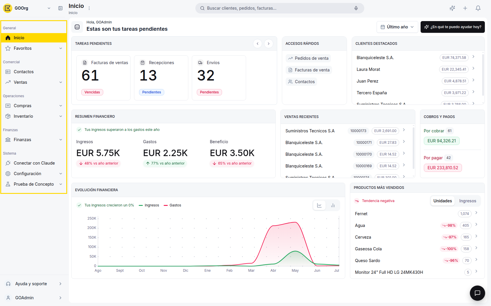
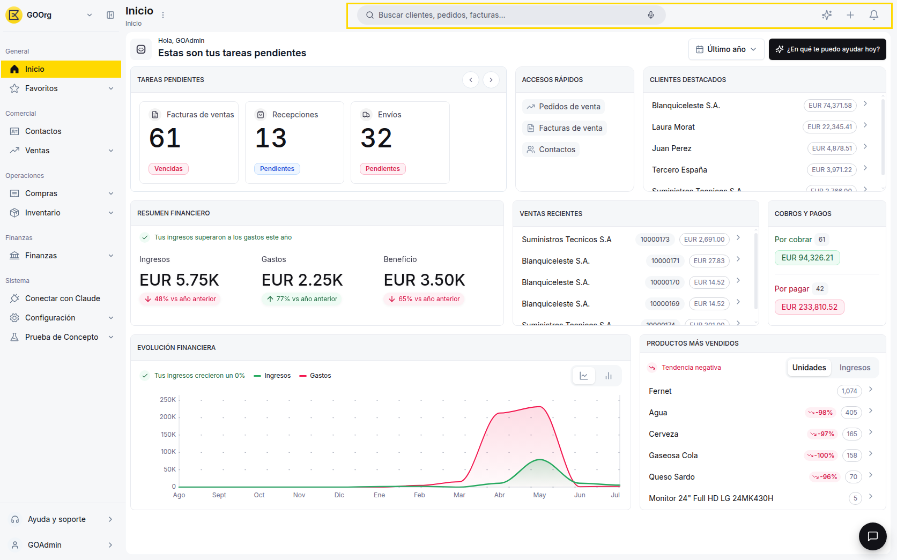
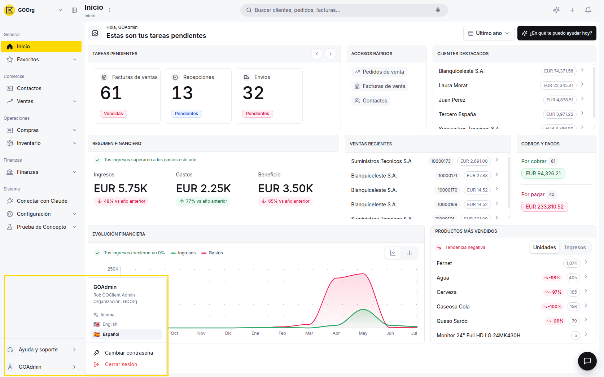
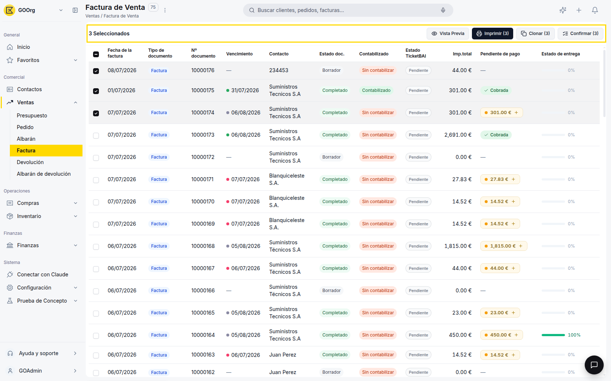

# Navegar en Etendo Go

Los elementos que se describen en esta guía son transversales: aparecen de la misma forma en todos los módulos de Etendo Go (Comercial, Operaciones, Finanzas, Inventario, Configuración...), así que una vez que los reconozcas vas a poder moverte por cualquier pantalla del producto sin perderte.

---

## Menús y botones principales

Estos son los elementos de navegación de alto nivel que vas a encontrar en la parte superior e izquierda de la pantalla, sin importar en qué módulo estés trabajando.

### Menú lateral

La barra vertical ubicada a la izquierda de la pantalla agrupa el acceso a todos los módulos de Etendo Go, organizados en secciones con etiquetas: **General**, **Comercial**, **Operaciones**, **Finanzas** y **Sistema**. Haz clic en cualquier ícono para desplegar sus secciones.

### Selector de empresa

Junto al logo, en la esquina superior izquierda, hay un menú desplegable con el nombre de la organización activa (por ejemplo, "GOOrg") y una flecha. Al hacer clic se abre un menú titulado **Cambiar empresa** que lista las organizaciones disponibles para tu cuenta, y permite cambiar de una empresa a otra sin necesidad de cerrar sesión.

### Acciones rápidas

En la parte superior de la pantalla encuentras una barra de búsqueda grande y prominente, ubicada en el centro superior, con la descripción "Buscar clientes, pedidos, facturas..." A su vez, en el extremo superior derecho encuentras dos accesos directos:

- **Crear** — genera un nuevo registro sin salir de la pantalla en la que estás.
- **Notificaciones** — avisos sobre tareas pendientes y novedades de tu cuenta.

!!! tip "Búsqueda global"
    Desde la barra de búsqueda central puedes encontrar contactos, documentos y pantallas de configuración sin necesidad de navegar manualmente por el menú lateral.

### Menú de perfil de usuario

Ubicado en la parte inferior del menú lateral, al hacer clic en tu nombre de usuario se abre un panel que muestra tu **nombre de usuario**, tu **Rol** (por ejemplo, GOClient Admin), la **Organización** activa (por ejemplo, GOOrg), un selector de **Idioma** (English/Español), la opción de **Cambiar contraseña** y la opción de **Cerrar sesión**.

---

## Componentes recurrentes

Estos componentes se repiten en la mayoría de los listados y pantallas de detalle de Etendo Go, sin importar el módulo en el que estés.

### Barra de acciones masivas

Al seleccionar uno o más registros de un listado, aparece una barra con las acciones disponibles para aplicarlas a todos los elementos seleccionados a la vez: **Vista Previa**, **Imprimir**, **Clonar** y **Confirmar**. Cada botón muestra la cantidad de registros seleccionados entre paréntesis (por ejemplo, "Imprimir (3)").

### Filtros y segmentos

Permiten acotar un listado según condiciones específicas (estado, fecha, contacto, etc.) y guardar esas combinaciones como segmentos para reutilizarlas más adelante.

### Menú de opciones adicionales (tres puntos)

Ubicado junto al título de la página (al lado del breadcrumb y el nombre de la pantalla, por ejemplo "Factura de Compra"), agrupa acciones secundarias: **Añadir a favoritos** y **Ayuda de esta página**.

### Exportación/descarga

En un listado con registros, haz clic en el botón **Imprimir** de la barra de herramientas superior: se abre un panel de **Vista Previa** que ofrece exportar a **PDF**, **Excel** o **CSV**, además de imprimir directamente.

### Selector de fechas

Los campos de fecha usan un calendario desplegable que te permite elegir un día puntual o un rango, según la pantalla en la que estés.

---

## Atajos de teclado (EDITAR)

Etendo Go incluye combinaciones de teclas para agilizar tareas frecuentes sin depender del mouse.

| Acción                             | Atajo               |
|:------------------------------------|:---------------------|
| Abrir la búsqueda global            | ++ctrl+k++            |
| Guardar el registro actual?         | ++ctrl+s++            |

!!! tip "Atajos según el sistema operativo"
    En Windows y Linux usa **Ctrl**; en macOS, reemplázalo por **Cmd** en todas las combinaciones de esta tabla.

Con los menús, los componentes recurrentes y estos atajos, ya tienes lo necesario para moverte con confianza por cualquier pantalla de Etendo Go.

---
This work is licensed under :material-creative-commons: :fontawesome-brands-creative-commons-by: :fontawesome-brands-creative-commons-sa: [ CC BY-SA 2.5 ES](https://creativecommons.org/licenses/by-sa/2.5/es/){target="_blank"} by [Futit Services S.L](https://etendo.software){target="_blank"}.
