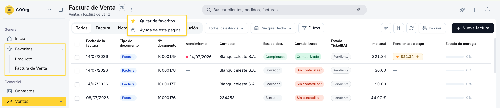
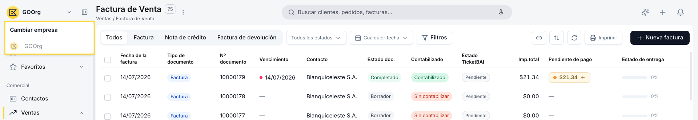
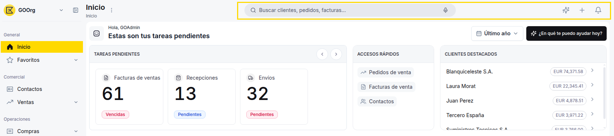
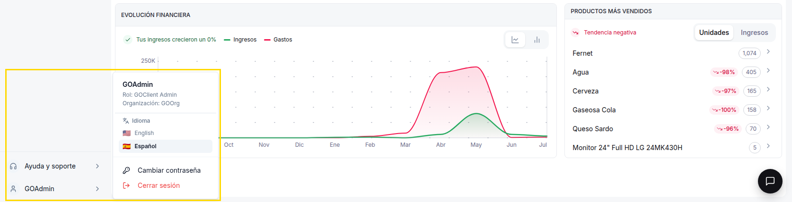
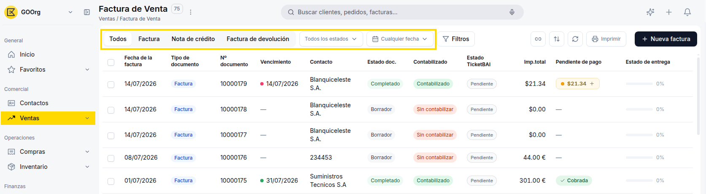
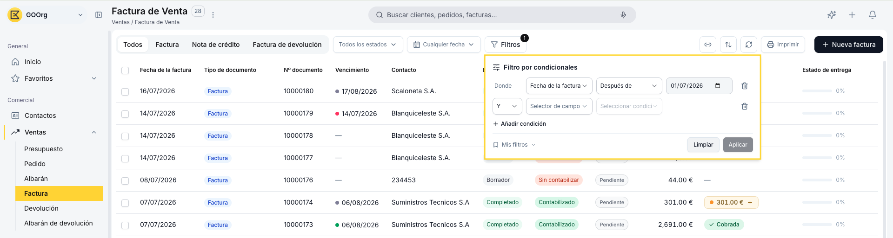
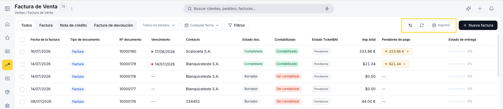
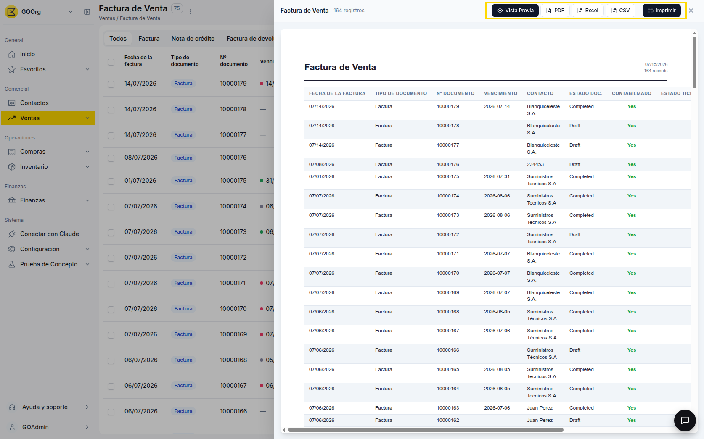
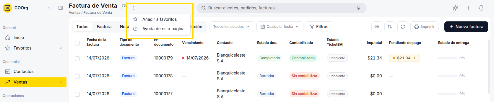

# Navegar en Etendo Go

Los elementos que se describen en esta guía son transversales: aparecen de la misma forma en todos los módulos de Etendo Go (Comercial, Operaciones, Finanzas, Inventario, Configuración...), así que una vez que los reconozcas vas a poder moverte por cualquier pantalla del producto sin perderte.

## Menús y botones principales 

Estos son los elementos de navegación de alto nivel que vas a encontrar en la parte superior e izquierda de la pantalla, sin importar en qué módulo estés trabajando.

### Menú lateral

La barra vertical ubicada a la izquierda de la pantalla agrupa el acceso a todos los módulos de Etendo Go, organizados en secciones con etiquetas: **General**, **Comercial**, **Operaciones**, **Finanzas** y **Sistema**. Haz clic en cualquier ícono para desplegar sus secciones.

Dentro del menú lateral, la sección **Favoritos** (identificada con un ícono de estrella) agrupa accesos directos a las ventanas que marcaste como favoritas, por ejemplo "Producto" o "Factura de Venta". Para añadir o quitar una ventana de esta lista, haz clic en los tres puntos ubicados junto a su nombre, tal como se describe en [Menú de opciones adicionales](#menu-de-opciones-adicionales).

### Selector de empresa

Junto al logo, en la esquina superior izquierda, hay un menú desplegable con el nombre de la organización activa (por ejemplo, "GOOrg") y una flecha. Al hacer clic se abre un menú titulado **Cambiar empresa** que lista las organizaciones disponibles para tu cuenta.

### Acciones rápidas

En la parte superior de la pantalla encuentras una barra de búsqueda grande y prominente, ubicada en el centro superior, con la descripción "Buscar clientes, pedidos, facturas..." A su vez, en el extremo superior derecho encuentras tres accesos directos:

- **Copilot** — abre el agente de IA integrado en la interfaz de Etendo Go, un asistente dentro de la propia plataforma que te ayuda a consultar información y a ejecutar acciones sin salir del sistema.
- **Crear** — genera un nuevo registro sin salir de la pantalla en la que estás.
- **Notificaciones** — avisos sobre tareas pendientes y novedades de tu cuenta.

!!! tip "Búsqueda global"
    Desde la barra de búsqueda central puedes encontrar contactos, documentos y pantallas de configuración sin necesidad de navegar manualmente por el menú lateral.

### Menú de perfil de usuario

Ubicado en la parte inferior del menú lateral, al hacer clic en tu nombre de usuario se abre un panel con la siguiente información:

- **Nombre de usuario** — identifica la cuenta con la que iniciaste sesión.
- **Rol** — el rol asignado dentro de la organización (por ejemplo, GOClient Admin), que determina qué acciones puedes realizar.
- **Organización** — la organización activa (por ejemplo, GOOrg).
- **Idioma** — selector para cambiar el idioma de la interfaz (English/Español).
- **Cambiar contraseña** — abre el formulario para actualizar tu contraseña de acceso.
- **Cerrar sesión** — finaliza tu sesión actual.

## Componentes recurrentes

Estos componentes se repiten en la mayoría de los listados y pantallas de detalle de Etendo Go, sin importar el módulo en el que estés. La mayoría forman parte de la barra de herramientas del listado y están siempre visibles; la barra de acciones masivas, en cambio, solo aparece cuando seleccionas uno o más registros.

### Filtros rápidos

Además del panel de condicionales, la barra del listado ofrece accesos directos para los filtros más comunes de esa ventana. Su cantidad y tipo varían según la ventana en la que estés trabajando. Por ejemplo, en la ventana **Factura de Venta** encuentras estos tres:

- **Todos**, **Factura**, **Nota de crédito** y **Factura de devolución** — pestañas que filtran el listado por tipo de documento; al seleccionar una (por ejemplo, "Factura"), el listado muestra solo los registros de ese tipo y oculta el resto, hasta que vuelvas a "Todos".
- **Todos los estados** — un desplegable con buscador que lista los estados disponibles (por ejemplo, Completado, Borrador) para filtrar por uno a la vez, o volver a "Todos los estados".
- **Cualquier fecha** — un desplegable con rangos predefinidos (Hoy, Ayer, Últimos 7 días, Últimos 30 días, Últimos 12 meses, Todo el tiempo) y un calendario de dos meses para elegir un día puntual o un rango a medida.

### Filtros

Al hacer clic en **Filtros** se abre un armador de condiciones personalizadas: eliges un campo (según la pantalla, por ejemplo "Contacto", "Estado doc." o "Fecha de la factura"), una condición y puedes sumar más opciones para acotar el listado. Desde el enlace **Mis filtros**, dentro del mismo panel, puedes guardar la combinación armada para reutilizarla más adelante sin reconstruirla.

### Ordenamiento y actualización

Junto a los filtros rápidos, en el extremo derecho de la barra de herramientas del listado, encuentras dos accesos adicionales:

- **Ordenamiento** — el ícono de las flechas verticales abre un menú para elegir por qué campo ordenar el listado (por ejemplo, "Fecha de la factura" o "Nº documento").
- **Recargar** — el ícono de las flechas circulares actualiza la pantalla y trae los registros más recientes, útil si dejaste la ventana abierta un rato y el listado podría estar desactualizado.

Junto a estos dos íconos encontrarás también **Imprimir**, que abre el panel para exportar el listado completo — lo explicamos en detalle en [Exportar un listado](#exportar-un-listado).

### Exportar un listado

En un listado con registros, haz clic en el botón **Imprimir** de la barra de herramientas superior, junto a **Filtros**. Este botón es distinto del **Imprimir** de la [barra de acciones masivas](#barra-de-acciones-masivas): mientras aquel imprime directamente los registros seleccionados, este abre un panel con una vista previa del listado de documentos y botones para exportar la lista a **PDF**, **Excel** o **CSV**, además de imprimirla directamente.

### Barra de acciones masivas

Al seleccionar uno o más registros de un listado, aparece una barra con las acciones disponibles para aplicarlas a todos los elementos seleccionados a la vez: **Vista Previa**, **Imprimir**, **Clonar** y **Confirmar**. Los botones **Imprimir**, **Clonar** y **Confirmar** muestran la cantidad de registros seleccionados entre paréntesis (por ejemplo, "Imprimir (3)"); **Vista Previa** no lleva ese contador.

### Menú de opciones adicionales

El ícono de **tres puntos** ubicado junto al título de la página (al lado del nombre de la pantalla, por ejemplo "Factura de Venta") agrupa acciones secundarias: **Añadir a favoritos** y **Ayuda de esta página**.

## Artículos Relacionados

- [¿Qué es Etendo Go?](../que-es-etendo-go/que-es-etendo-go.md) — una introducción general a la plataforma antes de explorar su navegación.
- [Cómo crear tu cuenta](../como-crear-tu-cuenta/como-crear-tu-cuenta.md) — regístrate y configura tu cuenta en tres pasos: registro, perfil y datos de la empresa.
- [Contactos](../../comercial/contactos/que-es-la-seccion-contactos/que-es-la-seccion-contactos.md) — carga tus primeros clientes y proveedores para empezar a generar documentos de venta o compra.
- [Crear y gestionar pedidos](../../comercial/ventas/crear-y-gestionar-pedidos/crear-y-gestionar-pedidos.md) — pon en práctica los filtros y la barra de acciones masivas en un listado real.

Con los menús y los componentes recurrentes, ya tienes lo necesario para moverte con confianza por cualquier pantalla de Etendo Go.

---
Esta obra está bajo la licencia :material-creative-commons: :fontawesome-brands-creative-commons-by: :fontawesome-brands-creative-commons-sa: [CC BY-SA 2.5 ES](https://creativecommons.org/licenses/by-sa/2.5/es/){target="_blank"} de [Futit Services S.L](https://etendo.software){target="_blank"}.
