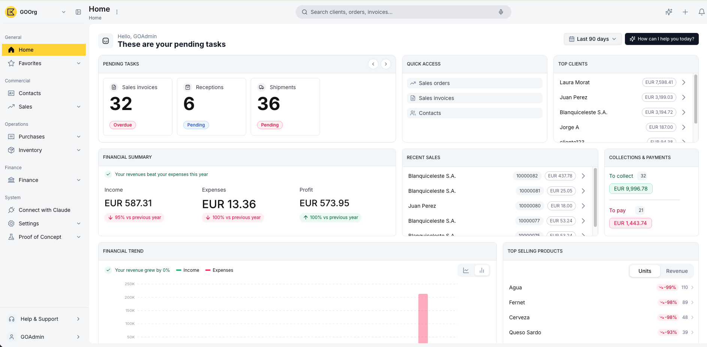

# ¿Qué es Etendo Go?

Etendo Go es el ERP (el software de gestión empresarial) en la nube de Etendo, pensado para empresas, autónomos y asesorías que necesitan gestionar su negocio sin complicaciones técnicas. Accedes desde el navegador, sin instalar nada ni mantener infraestructura propia, y siempre trabajas con la versión más actualizada.

Con Etendo Go gestionas Contactos, Ventas, Compras, Inventario y Finanzas desde un mismo lugar, y cuentas con **Copilot**, el agente de IA integrado en la interfaz de Etendo Go: un asistente dentro de la propia plataforma que te ayuda a consultar información y a ejecutar acciones sin salir del sistema.

## Un ERP para personas y para agentes de IA

Todo lo que haces en Etendo Go puede ejecutarse también mediante un agente de inteligencia artificial a través de MCP (Model Context Protocol), el estándar que conecta asistentes de IA con aplicaciones, con las mismas capacidades que tiene la interfaz visual. Este modelo dual te permite elegir, para cada tarea, el camino que más te convenga:

- **Desde la interfaz**: navega por los módulos, completa formularios y confirma documentos como en cualquier ERP.
- **Desde un agente**: automatiza flujos de negocio completos (crear un cliente, registrar una venta) conectando tu asistente de IA a Etendo Go mediante MCP, sin intervención manual.
- **Con Copilot**: pídele en lenguaje natural, desde la pantalla de inicio, que consulte datos o ejecute una acción por ti, como dar de alta un cliente o registrar una venta.

## Todo tu negocio, en un solo lugar

Etendo Go organiza la operación de tu empresa en módulos conectados entre sí, para que la información que cargas una vez esté disponible en todos los procesos relacionados:

- **Comercial**: un único maestro de **Contactos** para clientes y proveedores, con tarifas y condiciones de pago que se heredan en cada documento; **Ventas** para presupuestos, pedidos y facturas de venta; **Compras** para pedidos y facturas de compra.
- **Inventario**: productos, categorías de producto, almacenes, movimientos de mercancías, consumo interno, inventario físico e informes de stock.
- **Finanzas**: **Contabilidad** con asientos y cuentas contables; **Activos y Amortización** para tus bienes fijos y el cálculo automático de su depreciación; **Cuentas Financieras y Conciliación Bancaria**; **Cobros y Pagos**; y gestión de **Monedas y Tarifas**.
- **Cumplimiento**: la **Localización Española** cubre el envío a los Sistemas de Facturación (SIF) y la generación de los modelos fiscales `303` y `349`, entre otros.
- **Roles y Usuarios**: define qué puede hacer cada persona en el sistema mediante 5 roles predefinidos (**Administrador, Finanzas, Ventas, Compras** e **Inventario**); por ejemplo, solo **Administrador** y **Finanzas** pueden ejecutar las acciones contables de Activos y Amortización.

## Tu punto de partida: el Inicio

<figure markdown>
  
  <figcaption>Panel de Inicio de Etendo Go — resumen de tareas pendientes, ventas recientes y evolución financiera.</figcaption>
</figure>

Al iniciar sesión llegas al **Inicio**, que te da una fotografía rápida del negocio mediante los siguientes widgets:

- **Tareas pendientes** — acciones que requieren tu atención, como documentos por aprobar o facturas próximas a vencer.
- **Accesos rápidos** — atajos a las acciones más frecuentes, como dar de alta un cliente o crear un pedido de venta.
- **Clientes destacados** — los contactos con mayor actividad o facturación en el período seleccionado.
- **Resumen financiero** — una vista consolidada de ingresos, gastos y saldo del período.
- **Ventas recientes** — los últimos documentos de venta registrados en el sistema.
- **Cobros y pagos** — el estado de tus cobros pendientes y tus pagos programados.
- **Evolución financiera** — un gráfico con la tendencia de tus finanzas a lo largo del tiempo.
- **Productos más vendidos** — el ranking de productos con mayor rotación en el período.

Un filtro de período te permite enfocarte en el rango de fechas que te interesa en cada momento.

!!! tip "Empieza con Copilot"
    Desde el inicio, escríbele a Copilot lo que necesitas, por ejemplo, *"Crea un cliente nuevo"* — y deja que el asistente lo resuelva por ti.

## Artículos Relacionados

- [Cómo crear tu cuenta](../como-crear-tu-cuenta/como-crear-tu-cuenta.md) — regístrate y configura tu cuenta en tres pasos: registro, perfil y datos de la empresa.
- [Contactos](../../comercial/contactos/contactos.md) — carga tus primeros contactos antes de emitir tu primer documento de venta o compra.

Con la cuenta lista, puedes empezar a facturar, registrar gastos y consultar reportes en cuestión de minutos. Prueba Etendo Go, sin necesidad de tarjeta de crédito ni configuración adicional.

---
Esta obra está bajo la licencia :material-creative-commons: :fontawesome-brands-creative-commons-by: :fontawesome-brands-creative-commons-sa: [CC BY-SA 2.5 ES](https://creativecommons.org/licenses/by-sa/2.5/es/){target="_blank"} de [Futit Services S.L](https://etendo.software){target="_blank"}.
