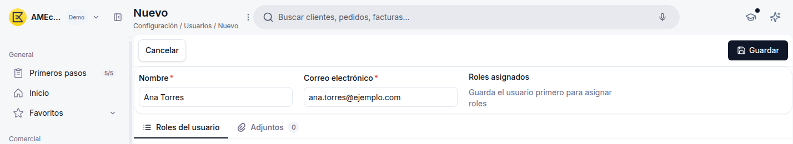

# Cómo invitar a un usuario

Desde **[Sistema > Configuración > Usuarios](https://app.etendo.ai/user){target="_blank"}** invitas a las personas de tu equipo a tu cuenta de Etendo.

- Necesitas el rol **Administrador**: es el único que puede gestionar usuarios.

<figure markdown="span">
  
  <figcaption>Formulario de un nuevo usuario, con Nombre y Correo electrónico completados antes de guardar.</figcaption>
</figure>

1. En el menú lateral, dentro de **Sistema > Configuración**, haz clic en **[Usuarios](https://app.etendo.ai/user){target="_blank"}**.
2. Haz clic en **+ Nuevo usuario**.
3. Completa **Nombre** y **Correo electrónico** (ambos obligatorios).
4. Haz clic en **Guardar**.

Al guardar, Etendo crea el usuario y le envía automáticamente una invitación por correo electrónico — no hay un paso separado para "enviar la invitación". El usuario queda con la etiqueta **Invitación pendiente** hasta que la acepta, y en la lista de Usuarios su columna **Roles** aparece vacía ("—") hasta que le asignas un rol; puedes asignárselo aunque la invitación siga pendiente.

Para reenviar la invitación, cambiarle el rol o eliminar al usuario, consulta [Gestionar tus usuarios](../gestionar-tus-usuarios/gestionar-tus-usuarios.md).

## Artículos relacionados

- [¿Qué es la sección Roles y usuarios?](../que-es-roles-y-usuarios/que-es-roles-y-usuarios.md)
- [Gestionar tus usuarios](../gestionar-tus-usuarios/gestionar-tus-usuarios.md)
- [Glosario de Roles y usuarios](../glosario-de-roles-y-usuarios/glosario-de-roles-y-usuarios.md)

---
Esta obra está bajo la licencia :material-creative-commons: :fontawesome-brands-creative-commons-by: :fontawesome-brands-creative-commons-sa: [CC BY-SA 2.5 ES](https://creativecommons.org/licenses/by-sa/2.5/es/){target="_blank"} de [Futit Services S.L](https://etendo.software){target="_blank"}.
