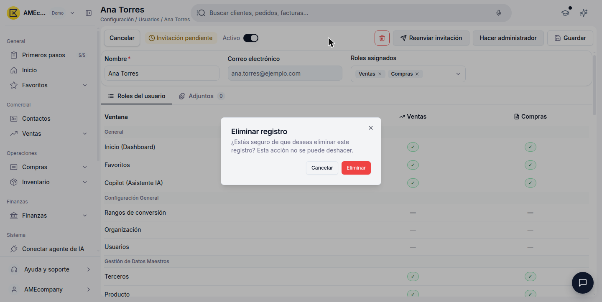

# Cómo invitar a un usuario

Desde **Sistema > Configuración > Usuarios** invitas a las personas de tu equipo a tu cuenta de Etendo y administras su acceso: reenviar una invitación, cambiar el rol de un usuario o quitarle el acceso cuando ya no lo necesite.

!!! info "Necesitas el rol Administrador"
    Es el único rol con acceso a Configuración. Consulta el [Glosario de Roles y usuarios](../glosario-de-roles-y-usuarios/glosario-de-roles-y-usuarios.md) para ver qué puede hacer cada rol.

## Invitar a un usuario

<figure markdown="span">
  
  <figcaption>Formulario de un nuevo usuario, con Nombre y Correo electrónico completados antes de guardar.</figcaption>
</figure>

Para invitar a alguien nuevo a tu cuenta:

1. En el menú lateral, dentro de **Sistema > Configuración**, haz clic en **Usuarios**.
2. Haz clic en **+ Nuevo usuario**.
3. Completa **Nombre** y **Correo electrónico** (ambos obligatorios).
4. Haz clic en **Guardar**.

Al guardar, Etendo crea el usuario y le envía automáticamente una invitación por correo electrónico — no hay un paso separado para "enviar la invitación". El usuario queda con la etiqueta **Invitación pendiente** hasta que la acepta, y en la lista de Usuarios su columna **Roles** aparece vacía ("—") hasta que le asignas un rol. Puedes hacerlo aunque la invitación siga pendiente, como se explica en [Cambiar el rol de un usuario](#cambiar-el-rol-de-un-usuario).

## Reenviar una invitación pendiente

Mientras un usuario no acepta la invitación, puedes reenviársela:

1. Entra a la ficha del usuario desde la lista de **Usuarios**.
2. Haz clic en **Reenviar invitación**, junto al indicador **Invitación pendiente**.

## Cambiar el rol de un usuario

<figure markdown="span">
  
  <figcaption>Roles asignados combinando Ventas y Compras, con la vista previa de permisos debajo.</figcaption>
</figure>

Entra a la ficha del usuario desde la lista de **Usuarios** y sigue uno de estos dos casos, según el rol que tenga hoy:

**Si el usuario tiene rol Administrador** y quieres darle uno de los otros cuatro roles:

1. Haz clic en **Quitar rol de administrador**.
2. El campo **Roles asignados** pasa a ser un desplegable con casillas — marca uno o varios de: **Ventas**, **Compras**, **Finanzas**, **Inventario**. A diferencia de Administrador, estos cuatro roles se pueden combinar entre sí en un mismo usuario.
3. Debajo, la pestaña **Roles del usuario** muestra al instante una vista previa de los permisos (ventana por ventana) que va a tener el usuario con los roles marcados.
4. Haz clic en **Guardar**.

**Si el usuario ya tiene Ventas, Compras, Finanzas y/o Inventario** y quieres ajustar la combinación:

1. En el desplegable **Roles asignados**, marca o desmarca las casillas que necesites.
2. Revisa la vista previa de permisos en la pestaña **Roles del usuario**.
3. Haz clic en **Guardar**.

Para darle acceso completo a un usuario en cualquier momento, entra a su ficha y haz clic en **Hacer administrador** — reemplaza cualquier otro rol que tuviera, ya que Administrador no se combina con los demás.

## Eliminar un usuario de tu cuenta

<figure markdown="span">
  
  <figcaption>Cuadro de confirmación antes de eliminar un usuario.</figcaption>
</figure>

Eliminar un usuario le quita el acceso a tu cuenta; también es la forma de **cancelar una invitación pendiente** que ya no quieres mantener (Etendo no tiene un botón de "cancelar" separado).

1. Entra a la ficha del usuario, o usa el botón **Eliminar** desde la fila correspondiente en la lista.
2. Confirma en el cuadro **Eliminar registro**.

!!! info "Esta acción no se puede deshacer"
    Etendo lo advierte explícitamente en el cuadro de confirmación.

Los registros que haya creado ese usuario (contactos, documentos, etc.) no se eliminan ni se ven afectados — se mantienen en tu cuenta tal como estaban.

## Artículos relacionados

- [¿Qué es la sección Roles y usuarios?](../que-es-roles-y-usuarios/que-es-roles-y-usuarios.md)
- [Gestionar tus usuarios](../gestionar-tus-usuarios/gestionar-tus-usuarios.md)
- [Glosario de Roles y usuarios](../glosario-de-roles-y-usuarios/glosario-de-roles-y-usuarios.md)

---
Esta obra está bajo la licencia :material-creative-commons: :fontawesome-brands-creative-commons-by: :fontawesome-brands-creative-commons-sa: [CC BY-SA 2.5 ES](https://creativecommons.org/licenses/by-sa/2.5/es/){target="_blank"} de [Futit Services S.L](https://etendo.software){target="_blank"}.
