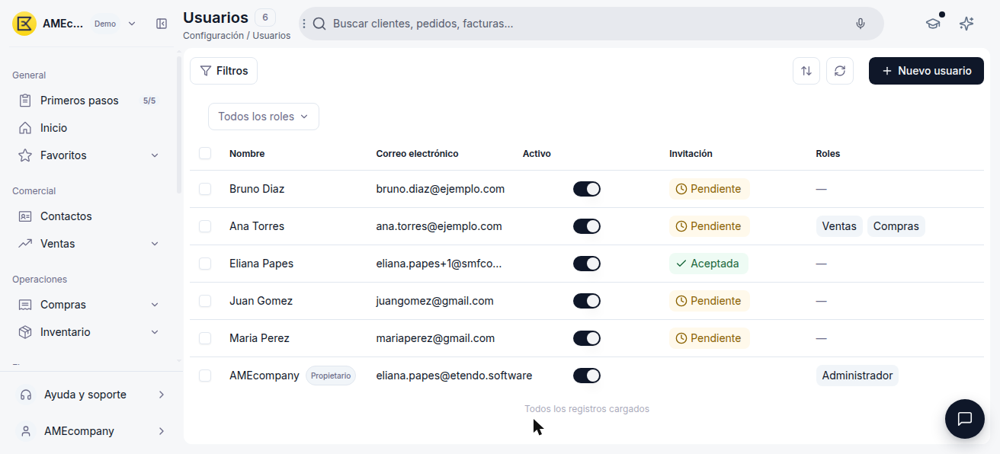
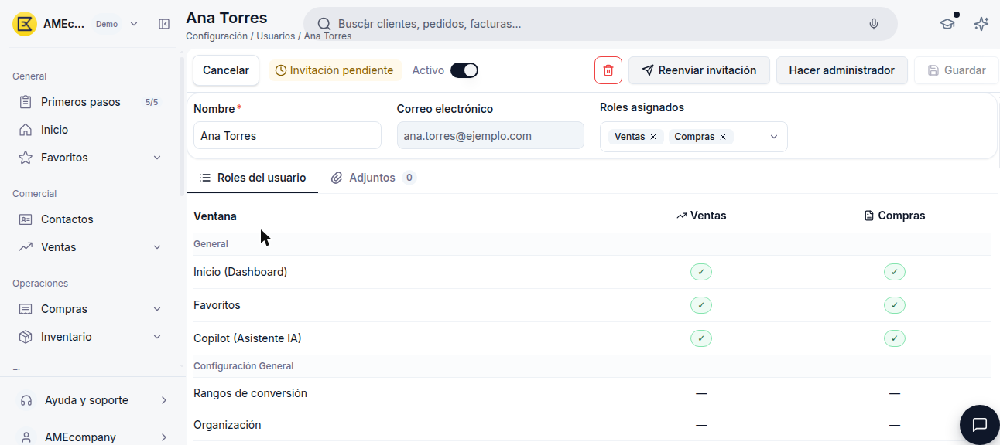
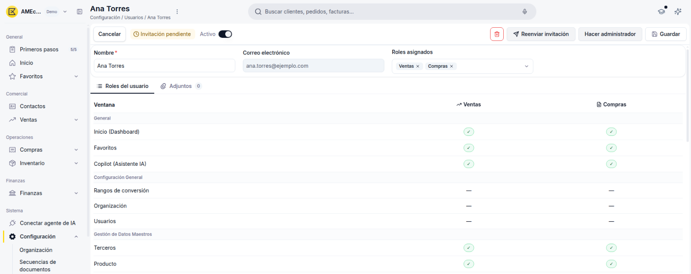

# Gestionar tus usuarios

La ventana **[Usuarios](https://app.etendo.ai/user){target="_blank"}** (Sistema > Configuración > Usuarios) reúne a todas las personas con acceso a tu cuenta. Para invitar a alguien nuevo, consulta [Cómo invitar a un usuario](../como-invitar-a-un-usuario/como-invitar-a-un-usuario.md).

!!! info "Necesitas el rol Administrador"
    Es el único rol con acceso a esta ventana — ningún otro rol la ve, ni siquiera en modo solo lectura.

## Vista Lista

<figure markdown="span">
  
  <figcaption>Vista lista de la ventana Usuarios.</figcaption>
</figure>

- **Nombre** y **Correo electrónico** — identifican al usuario.
- **Activo** — interruptor que habilita o deshabilita el acceso del usuario sin eliminarlo.
- **Invitación** — muestra **Pendiente** mientras el usuario no aceptó su invitación por correo, o **Aceptada** una vez que la aceptó.
- **Roles** — rol asignado al usuario. Queda vacío ("—") mientras la invitación está pendiente.
- Filtro **Todos los roles**, para acotar la lista a un rol específico.
- Botón **+ Nuevo usuario**, para invitar a alguien nuevo.

## Vista Detalle

<figure markdown="span">
  
  <figcaption>Ficha de detalle de un usuario, con sus roles y la vista previa de permisos.</figcaption>
</figure>

Al abrir un usuario desde la lista, accedes a su ficha con:

- Los campos **Nombre** y **Correo electrónico**.
- El campo **Roles asignados**, que resume el acceso vigente del usuario.
- Dos pestañas: **Roles del usuario** (detalle de permisos del rol asignado) y **Adjuntos**.
- En la barra superior, según el estado del usuario: el interruptor **Activo**, la etiqueta **Invitación pendiente** (si corresponde) y los botones de acción disponibles.

!!! info "Propietario"
    El usuario que creó la cuenta aparece etiquetado como **Propietario** junto a su nombre — no es un rol asignable. A diferencia de los demás usuarios, su ficha no muestra botones para cambiar de rol (no hay **Hacer administrador**, **Quitar rol de administrador** ni desplegable de **Roles asignados**): su acceso no se modifica desde esta pantalla. Ver definición completa en el [Glosario de Roles y usuarios](../glosario-de-roles-y-usuarios/glosario-de-roles-y-usuarios.md#propietario).

## Estados del Usuario

El estado de un usuario combina dos aspectos independientes: si tiene el acceso activo, y si ya aceptó la invitación. Por ejemplo, un usuario puede estar Inactivo y a la vez con su invitación Aceptada.

**Acceso**

| Estado | Descripción |
|---|---|
| Activo | El interruptor **Activo** está encendido; el usuario puede iniciar sesión. |
| Inactivo | El interruptor **Activo** está apagado; se le retira el acceso sin eliminar el registro. |

**Invitación**

| Estado | Descripción |
|---|---|
| Pendiente | El usuario fue creado pero todavía no aceptó el correo de invitación. Por defecto no tiene ningún rol asignado, pero puedes asignarle uno en cualquier momento, incluso antes de que acepte. |
| Aceptada | El usuario aceptó la invitación y ya puede acceder a la cuenta con el rol que tenga asignado. |

## Acciones Disponibles

| Acción | Dónde | Descripción |
|:-------|:------|:------------|
| Nuevo usuario | Vista lista | Invita a una persona nueva. Ver [Cómo invitar a un usuario](../como-invitar-a-un-usuario/como-invitar-a-un-usuario.md). |
| Editar | Fila de la lista / ficha | Abre la ficha del usuario. |
| Eliminar | Fila de la lista / ficha | Quita al usuario de la cuenta y cancela una invitación pendiente. Ver [Eliminar un usuario de tu cuenta](#eliminar-un-usuario-de-tu-cuenta). |
| Reenviar invitación | Ficha, si está pendiente | Vuelve a enviar el correo de invitación. Ver [Reenviar una invitación pendiente](#reenviar-una-invitacion-pendiente). |
| Activar / Desactivar | Ficha (interruptor Activo) | Habilita o deshabilita el acceso sin eliminar el usuario. El cambio se aplica al instante, sin pedir confirmación (a diferencia de Eliminar). |
| Cambiar rol / Hacer administrador | Ficha, campo Roles asignados | Asigna Ventas, Compras, Finanzas y/o Inventario, o vuelve a dar acceso completo. Ver [Cambiar el rol de un usuario](#cambiar-el-rol-de-un-usuario). |

### Reenviar una invitación pendiente

Mientras un usuario no acepta la invitación, puedes reenviársela:

1. Entra a la ficha del usuario desde la lista de **Usuarios**.
2. Haz clic en **Reenviar invitación**, junto al indicador **Invitación pendiente**.

### Cambiar el rol de un usuario

<figure markdown="span">
  
  <figcaption>Roles asignados combinando Ventas y Compras, con la vista previa de permisos debajo.</figcaption>
</figure>

Entra a la ficha del usuario desde la lista de **Usuarios**. El procedimiento depende del rol que tenga hoy:

#### Si el usuario tiene rol Administrador

Para darle uno de los otros cuatro roles:

1. Haz clic en **Quitar rol de administrador** — el cambio se aplica al instante, sin necesidad de hacer clic en Guardar.
2. El campo **Roles asignados** pasa a ser un desplegable con casillas — marca uno o varios de: **Ventas**, **Compras**, **Finanzas**, **Inventario**. A diferencia de Administrador, estos cuatro roles se pueden combinar entre sí en un mismo usuario.
3. Debajo, la pestaña **Roles del usuario** muestra al instante una vista previa de los permisos (ventana por ventana) que va a tener el usuario con los roles marcados.
4. Haz clic en **Guardar**.

#### Si el usuario ya tiene Ventas, Compras, Finanzas y/o Inventario

Para ajustar la combinación:

1. En el desplegable **Roles asignados**, marca o desmarca las casillas que necesites.
2. Revisa la vista previa de permisos en la pestaña **Roles del usuario**.
3. Haz clic en **Guardar**.

Para darle acceso completo a un usuario en cualquier momento, entra a su ficha y haz clic en **Hacer administrador** — el cambio se aplica al instante, sin pedir confirmación ni clic en Guardar, y reemplaza cualquier otro rol que tuviera, ya que Administrador no se combina con los demás.

### Eliminar un usuario de tu cuenta

<figure markdown="span">
  
  <figcaption>Cuadro de confirmación antes de eliminar un usuario.</figcaption>
</figure>

Eliminar un usuario le quita el acceso a tu cuenta; también es la forma de **cancelar una invitación pendiente** que ya no quieres mantener (Etendo no tiene un botón de "cancelar" separado).

1. Entra a la ficha del usuario.
2. Haz clic en **Eliminar** y confirma en el cuadro **Eliminar registro**.

!!! info "Esta acción no se puede deshacer"
    Etendo lo advierte explícitamente en el cuadro de confirmación.

Los registros que haya creado ese usuario (contactos, documentos, etc.) no se eliminan ni se ven afectados — se mantienen en tu cuenta tal como estaban.

!!! tip "Atajo desde la vista lista"
    También puedes hacer clic en **Eliminar** directamente desde la fila del usuario en la lista, sin entrar a su ficha.

## Artículos relacionados

- [¿Qué es la sección Roles y usuarios?](../que-es-roles-y-usuarios/que-es-roles-y-usuarios.md)
- [Cómo invitar a un usuario](../como-invitar-a-un-usuario/como-invitar-a-un-usuario.md)
- [Glosario de Roles y usuarios](../glosario-de-roles-y-usuarios/glosario-de-roles-y-usuarios.md)

---
Esta obra está bajo la licencia :material-creative-commons: :fontawesome-brands-creative-commons-by: :fontawesome-brands-creative-commons-sa: [CC BY-SA 2.5 ES](https://creativecommons.org/licenses/by-sa/2.5/es/){target="_blank"} de [Futit Services S.L](https://etendo.software){target="_blank"}.
