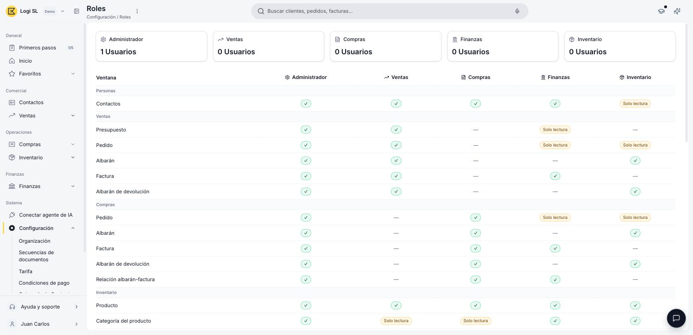

# ¿Qué es la sección Roles y usuarios?

La sección **Roles y usuarios**, dentro de **Configuración**, es donde decides quién más puede entrar a tu cuenta de Etendo y qué puede hacer una vez adentro. A cada persona que invitas le asignas un **rol**, y ese rol determina qué secciones puede ver, qué registros puede crear o editar, y qué acciones tiene disponibles.

A medida que tu equipo crece, esto te permite delegar tareas sin exponer información que no le corresponde a cada persona: por ejemplo, alguien de tu equipo comercial puede necesitar ver solo Contactos y Ventas, sin acceso a los datos fiscales de tu organización. Así trabajas con más gente sin perder el control de quién ve qué.

## Quién entra a tu cuenta

- **Usuario** — cada persona con acceso a tu cuenta, identificada por su nombre y su correo electrónico.
- **Invitación** — la forma de dar de alta a un usuario nuevo: le envías una invitación por correo electrónico y, hasta que la acepta, queda con estado **Invitación pendiente**.
- **Reenviar o eliminar** — puedes reenviar una invitación que no fue aceptada, o eliminar al usuario en cualquier momento; eso también cancela una invitación pendiente.
- **Desactivar** — bloquea el acceso de un usuario de forma temporal, sin eliminarlo.

## Qué determina el rol de cada usuario

<figure markdown="span">
  
  <figcaption>Ventana Roles (Configuración > Roles), con el detalle de acceso de cada rol.</figcaption>
</figure>

- **Rol** — agrupa un conjunto de permisos: qué secciones ve un usuario y con qué nivel de acceso cuenta en cada una.
- **Roles predefinidos** — Etendo ofrece cinco: Administrador, Ventas, Compras, Finanzas e Inventario, cada uno con acceso a un conjunto distinto de ventanas. Consulta el detalle completo en el [Glosario de Roles y usuarios](../glosario-de-roles-y-usuarios/glosario-de-roles-y-usuarios.md#acceso-por-rol).
- **Combinar roles** — Administrador es excluyente: un usuario con ese rol no puede tener ningún otro a la vez. Los otros cuatro sí se pueden combinar entre sí en un mismo usuario, por ejemplo Ventas y Finanzas juntos, para reflejar a alguien que cumple ambas funciones en tu equipo.
- **Nivel de acceso** — dentro de cada ventana, un rol puede tener acceso completo, solo lectura, o ningún acceso. Ver [Nivel de acceso](../glosario-de-roles-y-usuarios/glosario-de-roles-y-usuarios.md#nivel-de-acceso) en el glosario.
- **Administrador y Configuración** — solo Administrador ve ventanas como [Organización](https://app.etendo.ai/organization){target="_blank"}, [Usuarios](https://app.etendo.ai/user){target="_blank"} o [Secuencias de documentos](https://app.etendo.ai/document-sequence){target="_blank"}; otros catálogos que también viven dentro de Configuración, como [Tarifa](https://app.etendo.ai/price-list){target="_blank"} o [Condiciones de pago](https://app.etendo.ai/payment-term){target="_blank"}, sí son accesibles para algunos de los demás roles.

Si ya completaste los datos de tu organización, el siguiente paso natural es invitar a tu equipo.

## Artículos relacionados

- [Cómo invitar a un usuario](../como-invitar-a-un-usuario/como-invitar-a-un-usuario.md)
- [Gestionar tus usuarios](../gestionar-tus-usuarios/gestionar-tus-usuarios.md)
- [Glosario de Roles y usuarios](../glosario-de-roles-y-usuarios/glosario-de-roles-y-usuarios.md)

---
Esta obra está bajo la licencia :material-creative-commons: :fontawesome-brands-creative-commons-by: :fontawesome-brands-creative-commons-sa: [CC BY-SA 2.5 ES](https://creativecommons.org/licenses/by-sa/2.5/es/){target="_blank"} de [Futit Services S.L](https://etendo.software){target="_blank"}.
