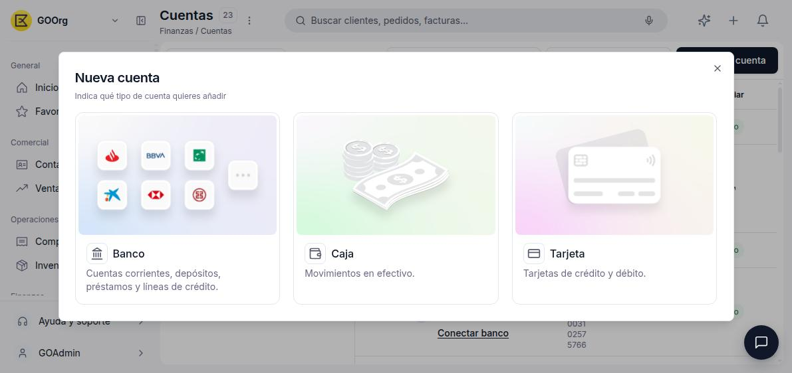
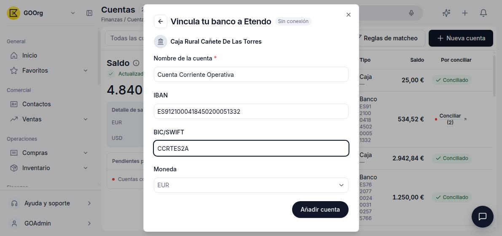

---
tags:
    - Tesorería
    - Cuentas financieras
    - Bancos
    - Etendo Go
---

# Añadir y configurar un banco, tarjeta o caja

Antes de registrar movimientos, extractos o pagos en Tesorería, necesitas dar de alta al menos una cuenta financiera. Etendo Go admite tres tipos: banco, tarjeta y caja.

## Elegir el tipo de cuenta

1. Ve a [**Finanzas > Cuentas**](https://go.etendo.cloud/financial-account).
2. Haz clic en **Nueva cuenta**.
3. Elige uno de los tres tipos disponibles:
      - **Banco** — cuentas corrientes, depósitos, préstamos y líneas de crédito.
      - **Caja** — movimientos en efectivo.
      - **Tarjeta** — tarjetas de crédito y débito.

Si elegiste **Banco** o **Tarjeta**, Etendo Go te pregunta a continuación si quieres crear la cuenta **Con conexión** o **Sin conexión**. **Caja** no ofrece esta opción: pasa directamente al formulario manual, porque no existe una entidad bancaria que sincronizar.

## Añadir una cuenta sin conexión

Usa esta opción si tu banco no admite conexión automática o prefieres introducir los movimientos a mano.

1. Elige **Sin conexión**.
2. Opcionalmente, busca y selecciona el banco o la entidad al que pertenece la cuenta (esto solo define el logo que se muestra en el listado). Si no aparece o no quieres indicarlo, usa **Continuar sin seleccionar banco**.
3. Completa el formulario:
      - **Nombre de la cuenta** (obligatorio).
      - **IBAN** (solo Banco).
      - **BIC/SWIFT** (solo Banco).
      - **Moneda** — EUR por defecto.
4. Haz clic en **Añadir cuenta**.

Para **Caja**, el formulario se reduce a **Nombre de la cuenta** y **Moneda**, sin IBAN ni BIC/SWIFT.

## Añadir una cuenta con conexión

Usa esta opción para que Etendo Go sincronice los movimientos automáticamente con tu banco (Open Banking), sin introducir datos a mano.

1. Elige **Con conexión**.
2. Busca tu banco en el buscador o selecciónalo del listado (Revolut, ING, BBVA, CaixaBank, y otros).
3. Completa la autenticación en la ventana que abre tu banco. La ventana se cierra sola al finalizar y Etendo Go sincroniza los movimientos existentes.

## Configurar la cuenta después de crearla

Desde el listado de **Cuentas**, usa **Editar cuenta** (icono de lápiz) para completar o ajustar la configuración:

- Pestaña **General**: nombre interno, IBAN, tipo de cuenta, moneda, conexión bancaria (**Conectar banco**), y la **Configuración de conciliación** de la cuenta (**Tolerancia de fecha en días** y **Tolerancia de importe en %**, usadas para sugerir coincidencias automáticas).
- Pestaña **Contabilidad**: **Cuenta bancaria** (la cuenta contable asociada, obligatoria) y **Cuenta transitoria** (opcional).

---

## Artículos Relacionados

- [¿Qué es la sección Tesorería?](../que-es-tesoreria/que-es-tesoreria.md)
- [Conectar, desconectar, desactivar o eliminar una cuenta bancaria](../como-conectar-desconectar-desactivar-o-eliminar-una-cuenta-bancaria/como-conectar-desconectar-desactivar-o-eliminar-una-cuenta-bancaria.md)
- [Gestionar cajas contables y movimientos en efectivo](../como-gestionar-cajas-contables-y-movimientos-en-efectivo/como-gestionar-cajas-contables-y-movimientos-en-efectivo.md)

---
Esta obra está bajo la licencia :material-creative-commons: :fontawesome-brands-creative-commons-by: :fontawesome-brands-creative-commons-sa: [CC BY-SA 2.5 ES](https://creativecommons.org/licenses/by-sa/2.5/es/){target="_blank"} de [Futit Services S.L](https://etendo.software){target="_blank"}.
