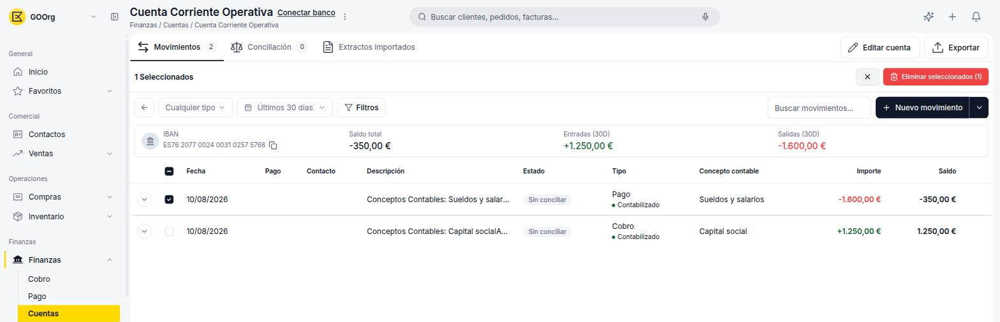
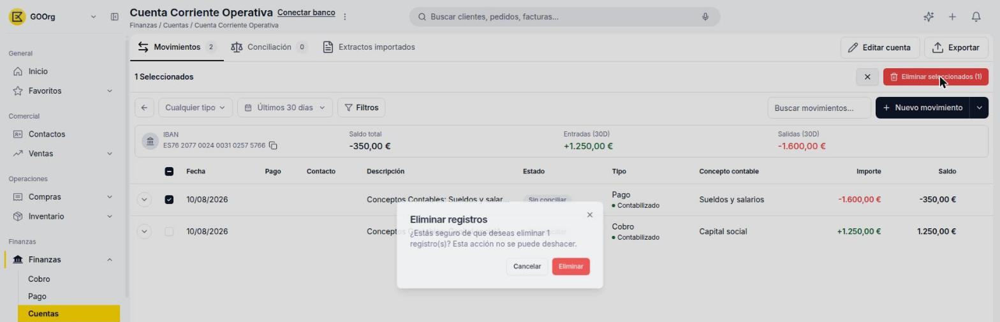

---
tags:
    - Tesorería
    - Extracto bancario
    - Etendo Go
---

# Borrar transacciones del extracto bancario

Si una importación generó movimientos duplicados o incorrectos, puedes borrarlos directamente desde la pestaña **Movimientos** de la cuenta.

## Borrar una transacción individual

1. Abre la cuenta desde **Finanzas > Cuentas** y ve a la pestaña **Movimientos**.
2. Marca la casilla de la fila que quieres borrar. Al seleccionar al menos un movimiento aparece la barra **X Seleccionados** con el botón **Eliminar seleccionados (X)**.

3. Haz clic en **Eliminar seleccionados (1)**.
4. Confirma en el diálogo **Eliminar registros**: *"¿Estás seguro de que deseas eliminar 1 registro(s)? Esta acción no se puede deshacer."*

## Borrar varias transacciones a la vez

1. En la pestaña **Movimientos**, marca la casilla de cada fila que quieras borrar, o usa la casilla del encabezado de la tabla para seleccionar todas las visibles.
2. Haz clic en **Eliminar seleccionados (X)** y confirma en el mismo diálogo.

---

## Artículos Relacionados

- [Importar o descargar el extracto bancario](../como-importar-o-descargar-el-extracto-bancario/como-importar-o-descargar-el-extracto-bancario.md)
- [¿Qué es la conciliación bancaria en Etendo Go?](../que-es-la-conciliacion-bancaria-en-etendo-go/que-es-la-conciliacion-bancaria-en-etendo-go.md)

---
Esta obra está bajo la licencia :material-creative-commons: :fontawesome-brands-creative-commons-by: :fontawesome-brands-creative-commons-sa: [CC BY-SA 2.5 ES](https://creativecommons.org/licenses/by-sa/2.5/es/){target="_blank"} de [Futit Services S.L](https://etendo.software){target="_blank"}.
