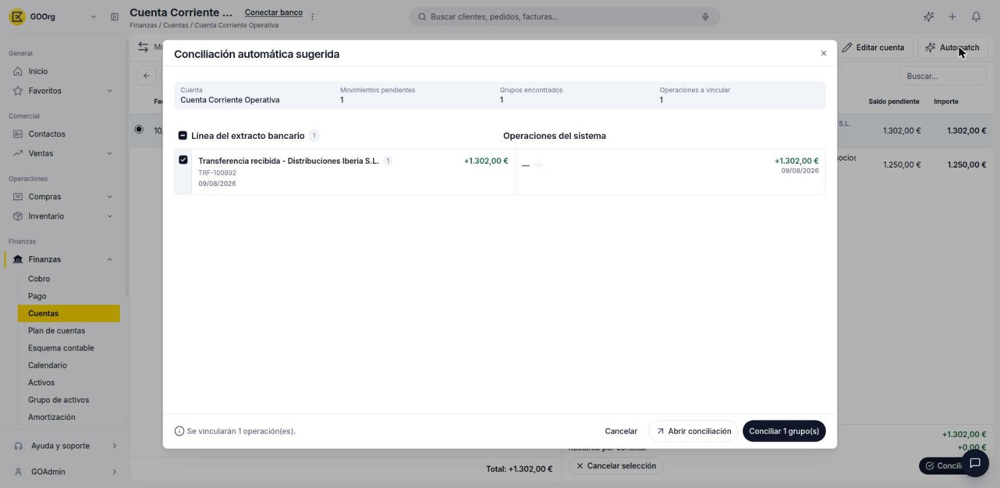
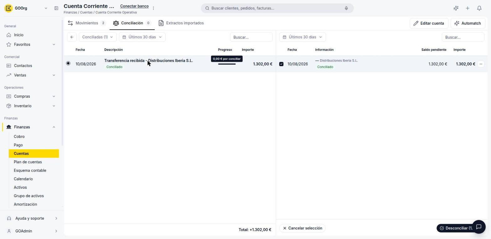

---
tags:
    - Tesorería
    - Conciliación bancaria
    - Etendo Go
---

# Conciliar o desconciliar movimientos contra documentos

Conciliar vincula una línea de tu extracto con el documento de Etendo Go que le corresponde (una factura, un cobro o un pago). Puedes hacerlo a mano, línea por línea, o dejar que Etendo Go proponga las coincidencias con Automatch.

## Estados de una línea de conciliación

En la pestaña **Conciliación** de una cuenta, cada línea puede filtrarse por estado: **Todos**, **Pendiente**, **Sugerido** (Automatch encontró una coincidencia), **Por regla** (coincide con una [regla de conciliación](../como-configurar-reglas-para-automatizar-la-conciliacion-bancaria/como-configurar-reglas-para-automatizar-la-conciliacion-bancaria.md)), **Diferencias** y **Conciliadas**.

## Conciliar un movimiento contra un documento

1. Abre la cuenta desde **Finanzas > Cuentas** y ve a la pestaña **Conciliación**.
2. Selecciona una línea con estado **Pendiente** en el panel izquierdo.
3. En el panel derecho, elige el tipo de documento a buscar: **Facturas de venta**, **Facturas de compra**, **Cobros** o **Pagos**.
4. Marca la casilla del documento (o documentos) que corresponden a la línea. Abajo se actualizan **Documentos seleccionados** y **Restante por conciliar**.
5. Cuando el restante llega a 0, haz clic en **Conciliar**.

Para conciliar varias líneas a la vez, usa **Automatch** (arriba a la derecha): Etendo Go agrupa las líneas del extracto con sus operaciones correspondientes y muestra cuántos **Grupos encontrados** y **Operaciones a vincular** detectó. Revisa los pares propuestos y confirma con **Conciliar [N] grupo(s)**.

## Desconciliar un movimiento

1. En la pestaña **Conciliación**, cambia el filtro a **Conciliadas**.
2. Selecciona la línea que quieres desconciliar. El panel derecho muestra el documento vinculado, ya marcado.
3. Haz clic en **Desconciliar (1)**.

    

4. Confirma en el diálogo **¿Desconciliar documento?**: *"El documento se desconciliará de la línea de extracto y su importe volverá al saldo por conciliar"*. El aviso aclara que la acción **deshará la conciliación del documento**.

---

## Artículos Relacionados

- [¿Qué es la conciliación bancaria en Etendo Go?](../que-es-la-conciliacion-bancaria-en-etendo-go/que-es-la-conciliacion-bancaria-en-etendo-go.md)
- [Configurar reglas para automatizar la conciliación](../como-configurar-reglas-para-automatizar-la-conciliacion-bancaria/como-configurar-reglas-para-automatizar-la-conciliacion-bancaria.md)
- [Gestionar pagos y cobros](../como-gestionar-pagos-y-cobros/como-gestionar-pagos-y-cobros.md)

---
Esta obra está bajo la licencia :material-creative-commons: :fontawesome-brands-creative-commons-by: :fontawesome-brands-creative-commons-sa: [CC BY-SA 2.5 ES](https://creativecommons.org/licenses/by-sa/2.5/es/){target="_blank"} de [Futit Services S.L](https://etendo.software){target="_blank"}.
