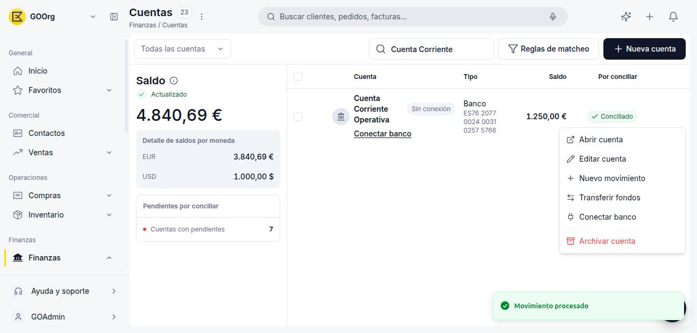

---
tags:
    - Tesorería
    - Cuentas bancarias
    - Etendo Go
---

# Conectar, desconectar, desactivar o eliminar una cuenta bancaria

Una vez que tienes una cuenta creada en Tesorería, puedes cambiar su estado de conexión con el banco o dejar de usarla sin borrar su historial.

Todas las acciones de esta página se disparan desde el mismo menú: en el listado de **Cuentas**, pasa el cursor sobre la fila de la cuenta y haz clic en el icono ⋮ de la derecha.

## Conectar una cuenta bancaria

Aplica a cuentas de tipo Banco o Tarjeta creadas como **Sin conexión**.

1. Ve a [**Finanzas > Cuentas**](https://go.etendo.cloud/financial-account).
2. En la fila de la cuenta, haz clic en **Conectar banco** (o abre **Acciones de la fila > Conectar banco**).
3. Busca y selecciona tu banco en el listado.
4. Completa la autenticación en la ventana que abre el banco. Se cierra sola al finalizar y la cuenta pasa a mostrar el estado **Sincronizado**.

## Desconectar una cuenta bancaria

Aplica solo a cuentas ya conectadas (estado **Sincronizado**). Detiene la sincronización automática; la cuenta y su historial de movimientos no se eliminan.

1. En el listado de **Cuentas**, abre **Acciones de la fila** sobre la cuenta conectada.
2. Selecciona **Desconectar banco**.
3. Confirma en el diálogo **¿Desconectar esta conexión bancaria?**: *"La conexión quedará desactivada. Dejarán de sincronizarse los extractos, pero se conserva el vínculo para poder reconectar más adelante sin perder el historial."*

La cuenta vuelve a mostrarse como **Sin conexión** en el listado, con el enlace **Conectar banco** disponible para reconectarla. Conserva su saldo y el estado de conciliación de los movimientos ya sincronizados.

## Desactivar una cuenta bancaria

En Etendo Go, "desactivar" corresponde a la acción **Archivar cuenta**.

1. En el listado de **Cuentas**, abre **Acciones de la fila** (o **Editar cuenta**) sobre la cuenta.
2. Selecciona **Archivar cuenta**.
3. Confirma en el diálogo **¿Seguro que quieres archivar esta cuenta?**. La cuenta deja de aparecer en el listado de **Todas las cuentas** y pasa al filtro **Inactivas**.

## Reactivar una cuenta archivada

1. En el listado de **Cuentas**, cambia el filtro a **Inactivas**.
2. Sobre la cuenta que quieras reactivar, abre **Acciones de la fila** (o **Editar cuenta**) y selecciona **Desarchivar cuenta**.
3. Confirma en el diálogo correspondiente. La cuenta vuelve a aparecer en el listado de **Todas las cuentas**, con su saldo e historial intactos.

---

## Artículos Relacionados

- [Añadir y configurar un banco, tarjeta o caja](../como-anadir-y-configurar-un-banco-tarjeta-o-caja/como-anadir-y-configurar-un-banco-tarjeta-o-caja.md)
- [Importar o descargar el extracto bancario](../como-importar-o-descargar-el-extracto-bancario/como-importar-o-descargar-el-extracto-bancario.md)
- [¿Qué es la conciliación bancaria en Etendo Go?](../que-es-la-conciliacion-bancaria-en-etendo-go/que-es-la-conciliacion-bancaria-en-etendo-go.md)

---
Esta obra está bajo la licencia :material-creative-commons: :fontawesome-brands-creative-commons-by: :fontawesome-brands-creative-commons-sa: [CC BY-SA 2.5 ES](https://creativecommons.org/licenses/by-sa/2.5/es/){target="_blank"} de [Futit Services S.L](https://etendo.software){target="_blank"}.
