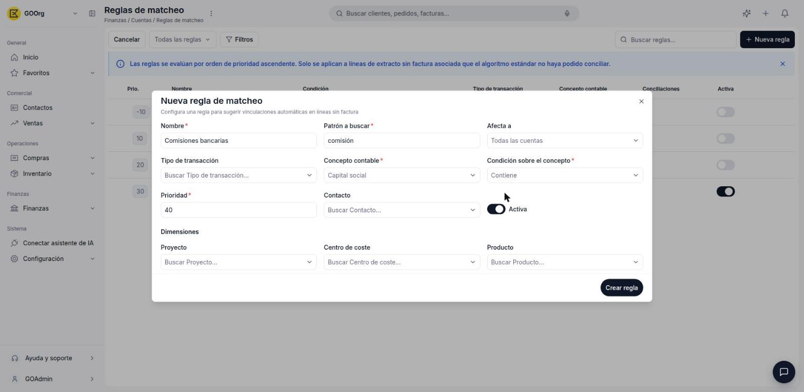
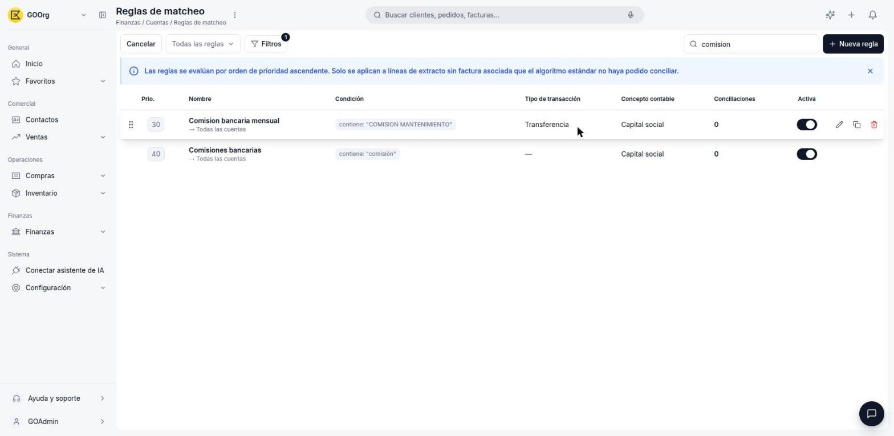

---
tags:
    - Tesorería
    - Conciliación bancaria
    - Automatización
    - Etendo Go
---

# Configurar reglas para automatizar la conciliación

Cuando un movimiento se repite con el mismo texto pero no tiene una factura asociada (por ejemplo, una comisión bancaria mensual), una regla de matcheo lo reconcilia solo, sin que tengas que buscarlo a mano cada vez.

> Las reglas solo se aplican a líneas de extracto **sin factura asociada** que el algoritmo estándar de conciliación (Automatch) no haya podido conciliar. Se evalúan en orden de **prioridad ascendente**: la de menor número se prueba primero.

## Crear una regla de conciliación automática

1. Ve a [**Finanzas > Cuentas**](https://go.etendo.cloud/financial-account) y haz clic en [**Reglas de matcheo**](https://go.etendo.cloud/match-rule).
2. Haz clic en **Nueva regla**.
3. Completa los campos obligatorios:
      - **Nombre** (por ejemplo, "Comisiones bancarias").
      - **Patrón a buscar** (por ejemplo, "comisión").
      - **Concepto contable** — la cuenta contable que se asigna al movimiento cuando la regla aplica.
      - **Condición sobre el concepto** — cómo se compara el patrón contra la descripción del movimiento: **Contiene**, **Empieza con** o **Regex**.
      - **Prioridad** — numérica, por defecto `40`. A menor número, mayor prioridad.
4. Opcionalmente, define:
      - **Afecta a** — una cuenta específica o **Todas las cuentas** (valor por defecto).
      - **Tipo de transacción** (por ejemplo, Comisión, Transferencia).
      - **Contacto** y las **Dimensiones** (Proyecto, Centro de coste, Producto).
      - Si la regla queda **Activa** (encendido por defecto).
5. Haz clic en **Crear regla**.

## Editar o desactivar una regla existente

- Para activar o desactivar una regla sin editarla, usa el interruptor de la columna **Activa** en el listado de **Reglas de matcheo**.
- Para editar, duplicar o eliminar una regla, pasa el cursor sobre su fila y usa los íconos que aparecen a la derecha (lápiz, copiar, papelera).
- Para reordenar la prioridad, arrastra la fila desde el ícono de agarre (⠿) a la izquierda, o edita el campo **Prioridad** directamente.

La columna **Conciliaciones** muestra cuántas veces conciliaciones reales usaron esa regla, lo que te ayuda a detectar reglas que nunca se aplican.

---

## Artículos Relacionados

- [¿Qué es la conciliación bancaria en Etendo Go?](../que-es-la-conciliacion-bancaria-en-etendo-go/que-es-la-conciliacion-bancaria-en-etendo-go.md)
- [Conciliar o desconciliar movimientos contra documentos](../como-conciliar-o-desconciliar-movimientos-contra-documentos/como-conciliar-o-desconciliar-movimientos-contra-documentos.md)

---
Esta obra está bajo la licencia :material-creative-commons: :fontawesome-brands-creative-commons-by: :fontawesome-brands-creative-commons-sa: [CC BY-SA 2.5 ES](https://creativecommons.org/licenses/by-sa/2.5/es/){target="_blank"} de [Futit Services S.L](https://etendo.software){target="_blank"}.
