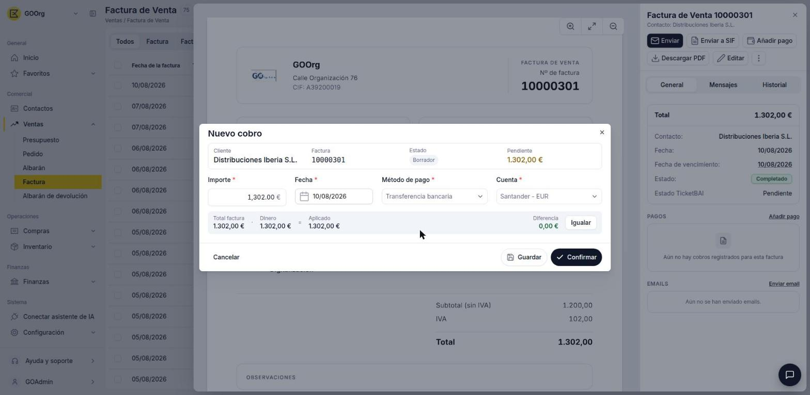
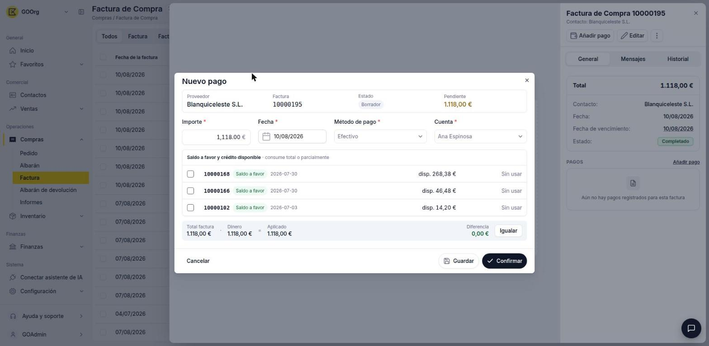

---
tags:
    - Tesorería
    - Pagos
    - Cobros
    - Etendo Go
---

# Gestionar pagos y cobros

Un cobro registra el dinero que recibes de un cliente por una factura de venta; un pago registra el dinero que entregas a un proveedor por una factura de compra. Ambos se crean desde la propia factura y quedan disponibles también en las vistas globales **Cobro** y **Pago** dentro de Finanzas.

## Registrar un cobro

1. Abre la factura de venta y haz clic en **Añadir pago**.
2. En **Nuevo cobro**, completa los campos obligatorios:
      - **Importe** — se autocompleta con el pendiente de la factura.
      - **Fecha**.
      - **Método de pago** — Efectivo, Transferencia bancaria, Cheque, Tarjeta o Transferencia.
      - **Cuenta** — la cuenta financiera donde se registra el ingreso. Las opciones dependen del método elegido (por ejemplo, con Efectivo solo aparecen cajas).
3. Si el cliente tiene **Saldo a favor** o **Crédito** disponible de otras facturas, puedes marcarlo para aplicarlo total o parcialmente en lugar de (o además de) un cobro nuevo.
4. Haz clic en **Guardar** para dejarlo en borrador, o en **Confirmar** para registrarlo.

## Registrar un pago

El flujo es igual al de un cobro, pero desde una factura de compra:

1. Abre la factura de compra y haz clic en **Añadir pago**.
2. En **Nuevo pago**, completa **Importe**, **Fecha**, **Método de pago** y **Cuenta**.
3. Usa la sección **Total factura / Dinero / Aplicado / Diferencia** para verificar que el pago cubre el total — el botón **Igualar** ajusta el importe para que la diferencia quede en 0.
4. Aplica **Saldo a favor** o **Crédito** del proveedor si corresponde.
5. Haz clic en **Guardar** o en **Confirmar**.

## Ejecutar y conciliar pagos y cobros

Un cobro o pago recién confirmado queda registrado con su actividad (por ejemplo, *"Cobro creado"* → *"Cobro confirmado · depositado"*), visible en el detalle del documento. Desde las vistas globales **Finanzas > Cobro** y **Finanzas > Pago** puedes:

- Ver el estado de cada uno (por ejemplo, **Cobro depositado**, **Pago depositado**) y el total del mes agrupado **Por método de pago**.
- Abrir cualquier cobro o pago para **Reactivar** (revertir su confirmación) o eliminarlo, si todavía no fue conciliado.

Una vez que el cobro o pago aparece en el extracto de tu cuenta, conciliarlo es igual que conciliar cualquier otro movimiento: ver [Conciliar o desconciliar movimientos contra documentos](../como-conciliar-o-desconciliar-movimientos-contra-documentos/como-conciliar-o-desconciliar-movimientos-contra-documentos.md).

Esto aplica sin importar el método de pago: tanto con **Efectivo** como con **Transferencia bancaria** o **Tarjeta**, al hacer clic en **Confirmar** el cobro o pago queda depositado directamente, sin un paso adicional de "Ejecutar".

---

## Artículos Relacionados

- [Factura de venta](../../comercial/ventas/factura-de-venta/factura-de-venta.md)
- [Factura de compra](../../operaciones/compras/factura-de-compra/factura-de-compra.md)
- [Gestionar cajas contables y movimientos en efectivo](../como-gestionar-cajas-contables-y-movimientos-en-efectivo/como-gestionar-cajas-contables-y-movimientos-en-efectivo.md)

---
Esta obra está bajo la licencia :material-creative-commons: :fontawesome-brands-creative-commons-by: :fontawesome-brands-creative-commons-sa: [CC BY-SA 2.5 ES](https://creativecommons.org/licenses/by-sa/2.5/es/){target="_blank"} de [Futit Services S.L](https://etendo.software){target="_blank"}.
