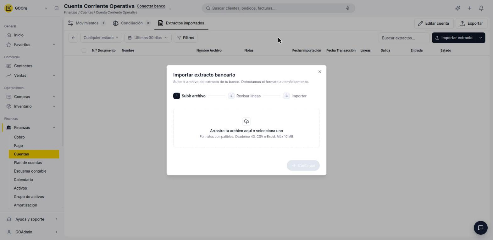
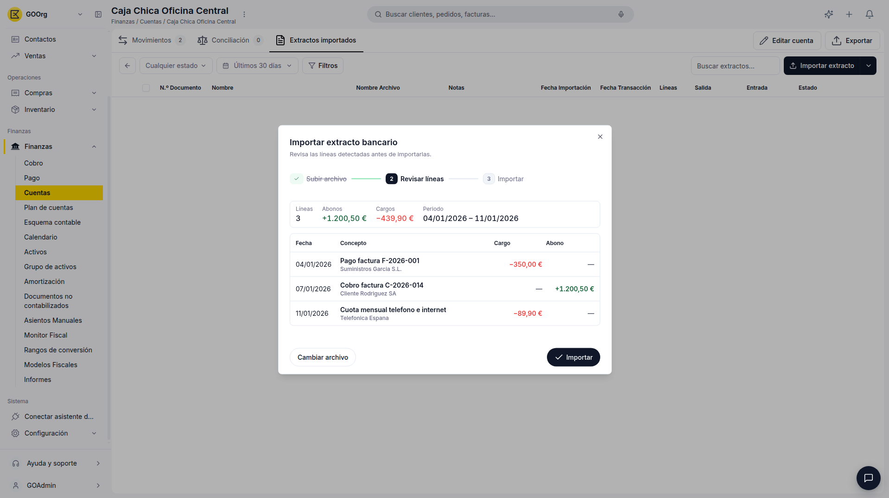
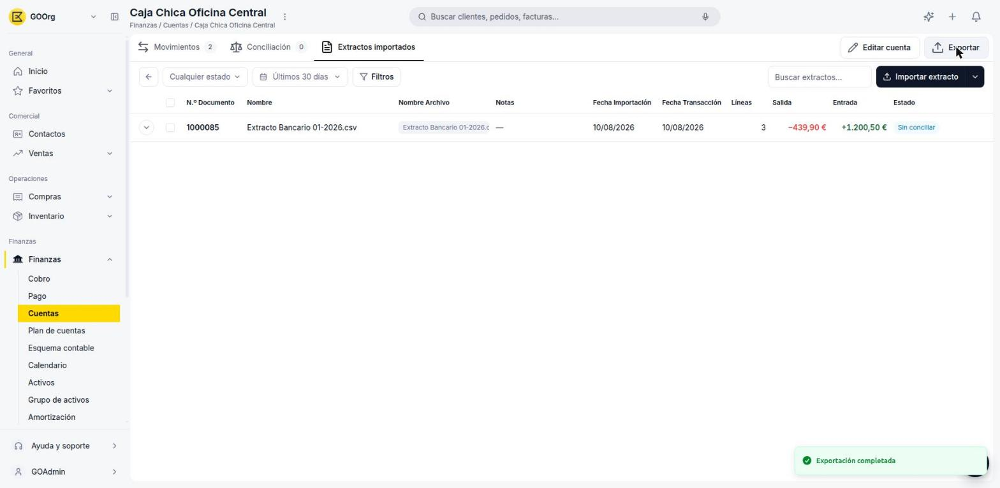

---
tags:
    - Tesorería
    - Extracto bancario
    - Etendo Go
---

# Importar o descargar el extracto bancario

Si tu cuenta no está conectada por Open Banking, puedes importar el extracto de tu banco como archivo para que Etendo Go genere los movimientos automáticamente.

## Importar el extracto bancario

1. Abre la cuenta desde **Finanzas > Cuentas** y ve a la pestaña **Extractos importados**.
2. Haz clic en **Importar extracto**.
3. En el paso **1. Subir archivo**, arrastra el archivo o selecciónalo desde tu equipo. Formatos compatibles: **Cuaderno 43**, **CSV** o **Excel** (máximo 10 MB). Etendo Go detecta el formato automáticamente.

    

4. En el paso **2. Revisar líneas**, comprueba las líneas detectadas antes de continuar: Etendo Go muestra el total de **Líneas**, **Abonos**, **Cargos** y el **Periodo** cubierto, junto con el detalle de cada línea (Fecha, Concepto y su importe como Cargo o Abono).

    

5. Completa el paso **3. Importar** para generar el extracto y sus líneas.

El extracto importado queda listado con su **N.º de documento**, **Fecha de importación**, **Fecha de transacción**, cantidad de **Líneas**, importes de **Salida**/**Entrada**, y su **Estado** (por ejemplo, **Conciliado** o **Parcial** si solo una parte de las líneas fue conciliada).

> Si necesitas cargar movimientos que no vienen en un archivo del banco, usa **Importar extracto > Nuevo extracto** para crear un extracto vacío y completarlo a mano.

## Descargar el extracto bancario

1. Abre la cuenta y ubícate en la pestaña que quieras exportar (por ejemplo, **Extractos importados** o **Movimientos**).
2. Haz clic en **Exportar**, arriba a la derecha.

La exportación se genera y descarga de inmediato (confirmado con el aviso **Exportación completada**), sin pasos intermedios.

> _Pendiente de confirmación manual: no se verificó el formato exacto del archivo exportado (Excel o CSV) ni si el contenido exportado corresponde solo a la pestaña activa o a toda la cuenta._

---

## Artículos Relacionados

- [Borrar transacciones del extracto bancario](../como-borrar-transacciones-del-extracto-bancario/como-borrar-transacciones-del-extracto-bancario.md)
- [¿Qué es la conciliación bancaria en Etendo Go?](../que-es-la-conciliacion-bancaria-en-etendo-go/que-es-la-conciliacion-bancaria-en-etendo-go.md)
- [Conciliar o desconciliar movimientos contra documentos](../como-conciliar-o-desconciliar-movimientos-contra-documentos/como-conciliar-o-desconciliar-movimientos-contra-documentos.md)

---
Esta obra está bajo la licencia :material-creative-commons: :fontawesome-brands-creative-commons-by: :fontawesome-brands-creative-commons-sa: [CC BY-SA 2.5 ES](https://creativecommons.org/licenses/by-sa/2.5/es/){target="_blank"} de [Futit Services S.L](https://etendo.software){target="_blank"}.
