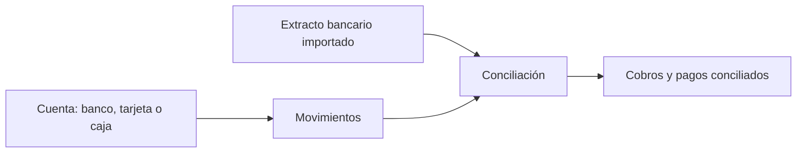

---
tags:
    - Tesorería
    - Cuentas financieras
    - Etendo Go
---

# ¿Qué es la sección Tesorería?

La sección **Tesorería** es donde Etendo Go centraliza tus cuentas de banco, tarjeta y caja, junto con todo lo que entra y sale de ellas: movimientos, extractos, conciliación bancaria, pagos y cobros. Desde acá controlas cuánto dinero tienes, en qué cuenta está y qué movimientos todavía no cruzaste contra tu banco.

En Etendo Go, Tesorería vive dentro del menú **Finanzas**, en la opción **Cuentas**, y se completa con dos pantallas propias para el seguimiento global de **Cobro** y **Pago**.

Cada cuenta financiera mantiene su propio saldo y su propio historial. Cuando conectas un banco o importas su extracto, Etendo Go compara esas líneas contra tus movimientos, pagos y cobros, y te permite conciliarlos —a mano o de forma automática— para que el saldo de la cuenta siempre coincida con el del banco.

## Qué incluye esta sección

- **Cuentas** — el listado de todas tus cuentas financieras (bancos, tarjetas y cajas), con su saldo, su moneda y sus pendientes de conciliar. Desde acá das de alta cuentas nuevas y accedes al detalle de cada una.
- **Movimientos** — dentro de cada cuenta, el historial de entradas y salidas (transferencias, pagos, cobros, retiradas de efectivo) con su estado: Borrador, Sin conciliar o Conciliado.
- **Extractos importados** — los archivos de extracto bancario que importaste para una cuenta, línea por línea.
- **Conciliación** — el cruce entre las líneas del extracto y tus movimientos, pagos y cobros, con sugerencias automáticas (**Automatch**) y conciliación manual.
- **Cobro** y **Pago** — el listado global de cobros a clientes y pagos a proveedores de todas tus cuentas, más allá de una cuenta en particular.

## Acceso y roles

_Pendiente de confirmación manual: no se verificaron restricciones de rol específicas para las ventanas de Tesorería en esta pasada. Confirmar si todos los roles ven Cuentas, Cobro y Pago o si hay pantallas restringidas a Finanzas/Administración._

## Recursos y próximos pasos

Para empezar a operar, da de alta tu primera cuenta desde [Añadir y configurar un banco, tarjeta o caja](../como-anadir-y-configurar-un-banco-tarjeta-o-caja/como-anadir-y-configurar-un-banco-tarjeta-o-caja.md). Si tu banco lo permite, puedes conectarla directamente en lugar de introducir los movimientos a mano.

---

## Artículos Relacionados

- [Añadir y configurar un banco, tarjeta o caja](../como-anadir-y-configurar-un-banco-tarjeta-o-caja/como-anadir-y-configurar-un-banco-tarjeta-o-caja.md)
- [¿Qué es la conciliación bancaria en Etendo Go?](../que-es-la-conciliacion-bancaria-en-etendo-go/que-es-la-conciliacion-bancaria-en-etendo-go.md)
- [Gestionar pagos y cobros](../como-gestionar-pagos-y-cobros/como-gestionar-pagos-y-cobros.md)

---
Esta obra está bajo la licencia :material-creative-commons: :fontawesome-brands-creative-commons-by: :fontawesome-brands-creative-commons-sa: [CC BY-SA 2.5 ES](https://creativecommons.org/licenses/by-sa/2.5/es/){target="_blank"} de [Futit Services S.L](https://etendo.software){target="_blank"}.
