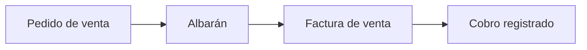

# ¿Qué es Etendo Go?

**Etendo Go** es la versión SaaS de Etendo ERP, diseñada para empresas que necesitan una solución de gestión empresarial ágil, accesible desde cualquier lugar y sin infraestructura propia.

<figure markdown>
  
  <figcaption>Vista principal del dashboard de Etendo Go — resumen de tareas pendientes, movimientos financieros y accesos rápidos.</figcaption>
</figure>

---

## ¿Qué incluye?

=== "Ventas"

    Gestiona tus pedidos, facturas y albaranes de venta desde un único lugar. Consulta el estado de cada operación en tiempo real.

=== "Compras"

    Controla tus pedidos y facturas de compra, gestiona proveedores y mantén el stock actualizado automáticamente.

=== "Finanzas"

    Concilia tus cuentas bancarias, gestiona la tesorería y genera informes financieros con un clic.

=== "Inventario"

    Gestiona almacenes, movimientos de stock y valoración de inventario de forma sencilla.

---

## Requisitos previos

Antes de comenzar, asegúrate de tener lo siguiente:

- [x] Una cuenta activa en Etendo Go
- [x] Acceso a internet desde un navegador moderno
- [ ] Datos de empresa configurados *(ver [Configuración inicial](primeros-pasos/configuracion-inicial.md))*
- [ ] Usuarios y roles asignados

---

## Primeros pasos

1.  **Accede a tu instancia**

    Ingresa a la URL que recibiste al activar tu cuenta y autentícate con tus credenciales.

2.  **Configura tu empresa**

    Completa los datos fiscales, moneda y ejercicio contable en :material-cog: **Configuración → Datos de empresa**.

3.  **Crea tus primeros contactos**

    Agrega clientes y proveedores desde **Contactos** antes de generar documentos.

4.  **Emite tu primer pedido**

    Ve a **Ventas → Pedidos de venta** y crea un nuevo pedido. El sistema generará el albarán y la factura automáticamente.

---

## Admonitions

!!! note "Nota"
    Etendo Go se actualiza automáticamente. No necesitas instalar ni descargar nada para tener siempre la última versión.

!!! tip "Consejo"
    Usa la búsqueda (`/` o clic en la lupa) para encontrar cualquier sección de la documentación sin necesidad de navegar manualmente.

!!! warning "Atención"
    Los datos eliminados no se pueden recuperar. Siempre verifica antes de confirmar una eliminación.

!!! danger "Importante"
    No compartas tus credenciales de acceso. Cada usuario debe tener su propia cuenta con los permisos correspondientes.

!!! info "Información"
    Esta documentación está actualizada para la versión **2.0** de Etendo Go.

!!! success "Listo"
    Si ves esta pantalla, tu instancia está activa y funcionando correctamente.

??? example "Ejemplo colapsable — Cómo crear una factura"
    1. Ve a **Ventas → Facturas de venta**
    2. Haz clic en **Nueva factura**
    3. Selecciona el cliente y agrega las líneas de producto
    4. Confirma y descarga el PDF

---

## Código de ejemplo

Puedes conectarte a la API de Etendo Go usando cualquier cliente HTTP:

```bash
curl -X POST https://go.etendo.cloud/api/auth/token \
  -H "Content-Type: application/json" \
  -d '{"username": "admin", "password": "••••••••"}'
```

```python title="etendo_client.py" linenums="1"
import requests

BASE_URL = "https://go.etendo.cloud/api"

def get_token(username: str, password: str) -> str:
    response = requests.post(
        f"{BASE_URL}/auth/token",
        json={"username": username, "password": password}
    )
    response.raise_for_status()
    return response.json()["token"]  # (1)!
```

1.  El token tiene una validez de **8 horas**. Renuévalo con el endpoint `/auth/refresh`.

```json title="Respuesta"
{
  "token": "eyJhbGciOiJIUzI1NiIsInR5cCI6IkpXVCJ9...",
  "expires_in": 28800
}
```

---

## Tabla de módulos

| Módulo        | Descripción                              | Estado       |
|:--------------|:-----------------------------------------|:------------:|
| Ventas        | Pedidos, facturas y albaranes            | ✅ Activo    |
| Compras       | Pedidos y facturas de proveedor          | ✅ Activo    |
| Finanzas      | Tesorería y conciliación bancaria        | ✅ Activo    |
| Inventario    | Almacenes y movimientos de stock         | ✅ Activo    |
| Producción    | Órdenes de fabricación y BOM             | 🔜 Próximo   |
| RRHH          | Gestión de empleados y nóminas           | 🔜 Próximo   |

---

## Texto con formato

Etendo Go soporta texto en **negrita**, *cursiva*, ~~tachado~~ y `código inline`.

También puedes usar teclas de teclado como ++ctrl+s++ para guardar, o ++cmd+k++ para buscar.

Texto con ^superíndice^ y ~subíndice~ para referencias técnicas.

> **Etendo Go** es la evolución natural de Etendo ERP hacia la nube.
> Diseñado para que cualquier empresa pueda operar con agilidad desde el primer día.

---

## Grids y tarjetas

<div class="grid cards" markdown>

-   :material-clock-fast:{ .lg .middle } **Configuración rápida**

    ---

    Ponete en marcha en minutos con la guía de configuración inicial.

    [:octicons-arrow-right-24: Primeros pasos](primeros-pasos/configuracion-inicial.md)

-   :material-currency-usd:{ .lg .middle } **Gestión financiera**

    ---

    Conciliá cuentas bancarias y generá informes con un clic.

    [:octicons-arrow-right-24: Finanzas](finanzas/index.md)

-   :material-truck-delivery:{ .lg .middle } **Ventas y compras**

    ---

    Controlá pedidos, facturas y albaranes desde un solo lugar.

    [:octicons-arrow-right-24: Ventas](ventas/index.md)

-   :material-warehouse:{ .lg .middle } **Inventario**

    ---

    Gestioná almacenes, movimientos de stock y valoración.

    [:octicons-arrow-right-24: Inventario](inventario/index.md)

</div>

---

## Botones

[Comenzar ahora](primeros-pasos/configuracion-inicial.md){ .md-button .md-button--primary }
[Ver primeros pasos](primeros-pasos/que-es-etendo-go.md){ .md-button }

---

## Lista de definiciones

`SaaS`
:   Software as a Service — modelo donde el software se aloja en la nube y se accede por suscripción.

`ERP`
:   Enterprise Resource Planning — sistema integrado para gestionar los procesos clave del negocio.

`API`
:   Application Programming Interface — interfaz que permite la comunicación entre sistemas de forma programática.

---

## Texto resaltado

Etendo Go incluye ==resaltado de texto== para marcar información clave. También podés combinar ==resaltado== con **negrita** o *cursiva* para mayor énfasis.

---

## Tooltips

Etendo Go cumple con el [RGPD](## "Reglamento General de Protección de Datos") y usa cifrado [TLS](## "Transport Layer Security") en todas las comunicaciones. Las abreviaciones también se pueden definir globalmente: al escribir SaaS o ERP en cualquier parte del documento, el tooltip aparece automáticamente.

*[RGPD]: Reglamento General de Protección de Datos
*[TLS]: Transport Layer Security
*[SaaS]: Software as a Service
*[ERP]: Enterprise Resource Planning

---

## Diagramas



---

## Footnotes

Etendo Go utiliza tecnología de código abierto[^1] y cumple con los requisitos del RGPD[^2].

[^1]: El código fuente base está disponible en [GitHub](https://github.com/etendosoftware).
[^2]: Reglamento General de Protección de Datos — Unión Europea.
